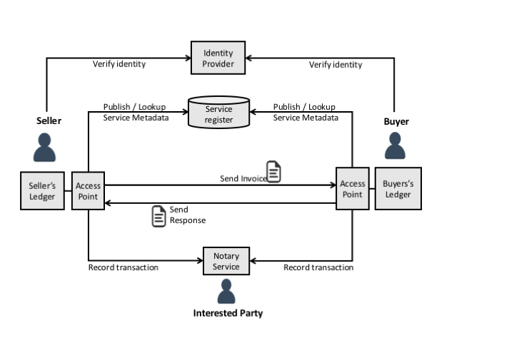

# Purpose of this site

Exchange of buisness documents like invoices between business finance systems ought to be as simple as email.  This site provides some open specifications and test services designed to make that easy.
* As a business, I want to send electronic invoices to my customer systems and know the payment status so I can manage my cashflow and get cheap debtor financing if I need it.
* As a business I want all invoices and tax receipts from my authorised suppliers to be automatically loaded to my financial system ready for my approval so I can reduce my administration burden.

We want the simplest, lowest cost and most secure solution to these needs so we've developed a suite of RESTful API standards and thrown in strong identity measures that support end-to-end encryption and digital signatures.  This site supports implementers by providing:
* A suite of [technical specifications](#the-technical-framework-specifications) and free test points.
* A suite of [semantic specifications](#the-business-document-semantic-specifications) and free test points.
* A set of [special interest groups](#the-special-interest-groups) with collaboration tools.
* A transparent [governance model](#specification-governance-model) with free participation for any interested party.

# Background

The [Australian Digital Business Council](http://digitalbusinesscouncil.com.au/) has promised to publish an interoperability framework that aims to increase national productivity through automation of common buisness processes such as invoicing.  We anticipate that the published standards will be framed as Australian implementation profiles of the following OASIS standards;
* A discovery model based on OASIS [BDX-L](http://docs.oasis-open.org/bdxr/BDX-Location/v1.0/cs01/BDX-Location-v1.0-cs01.html) and [SMP](http://docs.oasis-open.org/bdxr/bdx-smp/v1.0/cs01/bdx-smp-v1.0-cs01.html) standards
* A messaging model based on OASIS [ebMS3](http://docs.oasis-open.org/ebxml-msg/ebms/v3.0/core/os/ebms_core-3.0-spec-os.html) and [AS4](http://docs.oasis-open.org/ebxml-msg/ebms/v3.0/profiles/AS4-profile/v1.0/os/AS4-profile-v1.0-os.html) standards
* A semantic model based on OASIS [UBL 2.1](http://docs.oasis-open.org/ubl/UBL-2.1.html) standards

We will link to Australian profiles when they are published.  

The Digital Business Council has also created a RESTful working group that aims to provide a simpler and more secure implementation model based on ubiquitous internet standards such as REST.  This site is the repository for those specifications.  

# How it Works

Unlike single provider APIs (eg google or facebook), a B2B community needs all businesses to implement the same interface so that the same document format (e.g. an invoice) can be send from any business to any other business.  The many-to-many aspect of B2B transactions requires a few extra components in the framework as shown in the conceptual overview diagram.

* Ledger Access Points (LAPs) provide high availability end-points and logging services for business ledger systems.
* Identity Providers (IDPs) provide trusted identity verification for business participants.
* Service Metadata Publishers (SMPs) provide a lookup service for all service end-points for any given business.
* Notary Services (NRYs) provide a non-repudiable record of transactions for audit and financial service providers.

The success of the interoperability framework depends on uptake by the ledger software providers. Those systems must implement a number of interfaces in a consistent way - which requires clear standards, good test services, and easy to use tooling.  That is the purpose of this site.

# The Technical Framework Specifications

There are five technical specifications, each with it's own github repository.  Ledger vendors must implement in accordance with the [compliance statement](#compliance-statement-for-technical-specifications)

## The Identity Provider specification

A federated set of one or more identity providers are the key source of trust for the network.  This specification defines a standard taxonomy of OIDC claims and scopes, together with a set of identity assurance levels and a standard way to link identity claims.
* [IDP Working Group](https://github.com/ausdigital/identity-provider) GitHub repository.

| Specification URL | Version | Status | API Definition | Test Service | Issues List |
| ----------------- | ------  | ------ | -------------- | ------------ | -------- |
| [IDP 1.0 spec](https://identity-provider.readthedocs.org/) | 1.0 |   | [IDP 1.0 API](https://swaggerhub.com/api/ausdigital/identity-provider/1.0) | [idp.testpoint.io](https://idp.testpoint.io)  | [IDP 1.0 Issues](https://github.com/ausdigital/identity-provider/issues)  |

## The Digital Capability Locator specification

The framework assumes that there could be multiple metadata publishers (SMP) in the network and so the digital capability locator is essentially a DNS entry (NAPTR Record type) that is used to redirect a lookup query for a given business identifier to the correct SMP.

* [DCL Working Group](https://github.com/ausdigital/capability-locator) GitHub repository.

| Specification URL | Version | Status | API Definition | Test Service | Issues List |
| ----------------- | ------  | ------ | -------------- | ------------ | -------- |
| [DCL 1.0 spec](https://capability-locator.readthedocs.org) | 1.0 |   | [DCL 1.0 API](https://swaggerhub.com/api/ausdigital/capability-locator/1.0) | [dcp.testpoint.io](https://dcp.testpoint.io)  | [DCL 1.0 Issues](https://github.com/ausdigital/capability-locator/issues)   |

## The Service Metadata Publisher specification

The framework depends heavily on the ability to discover detailed service information for any given business identifier.  The SMP maintains a list of businesses, with a list of services for each business. Each service lists supported document formats and transport protocols and holds a digital certificate for message signing and encryption.

* [SMP Working Group](https://github.com/ausdigital/metadata-publisher) GitHub repository.

| Specification URL | Version | Status | API Definition | Test Service | Issues List |
| ----------------- | ------- | ------ | -------------- | ------------ | -------- |
| [SMP 1.0 spec](http://metadata-publisher.readthedocs.io/) | 1.0 |  | [SMP 1.0 API](https://swaggerhub.com/api/ausdigital/metadata-publisher/1.0)  | [smp.testpoint.io](https://smp.testpoint.io) | [SMP 1.0 Issues](https://github.com/ausdigital/metadata-publisher/issues)    |

## The Ledger Access Point specification

The ledger access point, is the service interface for a given business and so hosts the end-point to which business documents are sent. The access point is an avaialbility mediator (allowing specific businesses to have intermittent connectivity) and is responsible for signature validation and submitting transactions to the notary service.

* [LAP Working Group](https://github.com/ausdigital/access-point]) GitHub repository.

| Specification URL | Version | Status | API Definition | Test Service | Issues List |
| ----------------- | ------  | ------ | -------------- | ------------ | -------- |
| [LAP 1.0 spec](http://access-point.readthedocs.io/) | 1.0 |   | [LAP 1.0 API](https://swaggerhub.com/api/ausdigital/access-point/1.0) | [lap.testpoint.io](https://lap.testpoint.io) | [LAP 1.0 Issues](https://github.com/ausdigital/access-point/issues)  |

## The Notary specification

The notary serivce provides an irrefutable history of a specific "contract" (eg an invoice and it's status lifecycle), recorded in a blockchain distributed ledger.  This service supports dispute resolution and provides the foundation platform for financial services such as debtor financing.

* [NRY Working Group](https://github.com/ausdigital/notary) GitHub repository.

| Specification URL | Version | Status | API Definition | Test Service | Issues List |
| ----------------- | ------  | ------ | -------------- | ------------ | -------- |
| [NRY 1.0 spec](http://notary.readthedocs.io/) | 1.0 |    | [NRY 1.0 API](https://swaggerhub.com/api/ausdigital/notary/1.0) | [nry.testpoint.io](https://nry.testpoint.io)  | [NRY 1.0 Issues](https://github.com/ausdigital/notary/issues)  |

# The Business Document Semantic Specifications

The technical framework exists only to provide the foundation for the secure and reliable interchange of business documents such as electronic invoices.  The specifications in this section describe the semantics of each business document.  Note that;
* the semantics can vary depending on the process context - for example "commercial invoice" and "reciptient created tax invoice" are two different processes that leverage the same document type.   
* each process has at least two roles (eg Buyer and Seller) with different requirements under the specification.  

Therefore the semantic specifictions group compliance requirements by process and role.

Like the technical specifications, the semantic specification are developed using the [COSS](http://rfc.unprotocols.org/spec:2/COSS/) (Consensus Oriented Specification System) governance model.

## Billing Semantics specification

The Billing Specifications are based on [OASIS UBL2.1](http://docs.oasis-open.org/ubl/UBL-2.1.html) [billing semantics](http://docs.oasis-open.org/ubl/os-UBL-2.1/UBL-2.1.html#S-BILLING) and include the Invoice, Credit Note, Debit Note, and Application Response documents.  The process roles are buyer and seller.

* [Billing Working Group](https://github.com/ausdigital/billing-semantics) GitHub repository.

| Specification URL | Version | Status | API Definition | Test Service | Issues List |
| ----------------- | ------  | ------ | -------------- | ------------ | -------- |
| [Billing 1.0 spec](http://billing-semantics.readthedocs.io/) | 1.0 |  | [Billing 1.0 API](https://swaggerhub.com/api/ausdigital/billing/1.0) | [lap.testpoint.io](https://lap.testpoint.io)  | [Billing 1.0 Issues](https://github.com/ausdigital/billing-semantics/issues)  |

## Purchase Order semantics specification

Coming soon - let us know by [raising a ticket](https://github.com/ausdigital/ordering-semantics/issues) in the ordering semantics repository if you'd like to lead this group

## Fulfillment semantics specification

Coming soon - let us know by [raising a ticket](https://github.com/ausdigital/fulfilment-semantics/issues) in the fulfilment semantics repository if you'd like to lead this group

# The Special Interest Groups

We value the support and opinions of special interest groups and so we provide some collaboration tools to facilitate consultation and collaboration.  If you'd like to participate (or just watch the conversation) of a particular group then please follow the links to subscribe to the chat channel or low volume mailing list.  If you'd like to create a new special interest group, please join the engagement group and raise your request there.

| Group Name | Purpose | Chat Room | Mailing List | Archive |
| ---------- | ------- | --------- | ------------ | ------- |
| Engagement SIG | For stakeholder engagement and outreach - to engage all interested parties.  | [Engagement chat](https://talk.ausdigital.org/outreach-sig/channels/sig-development) | [List sign-up](http://eepurl.com/ccptxv) | [View archive](http://us14.campaign-archive1.com/home/?u=2f0838d563cfad631e78b6925&id=85aca3789a) |
| Development SIG | For implementers that would like to share their experiences and get help | [Developer chat](https://talk.ausdigital.org/outreach-sig/channels/sig-development) | [List sign-up](http://eepurl.com/cco_b5) | [View archive](http://us14.campaign-archive1.com/home/?u=2f0838d563cfad631e78b6925&id=c2da00d149) |
| Information Security SIG | For those concerned about information security and privacy issues related to the specifciations. | [Infosec chat](https://talk.ausdigital.org/outreach-sig/channels/sig-infosec) | [List sign-up](http://eepurl.com/ccpxuP) | [View archive](http://us14.campaign-archive1.com/home/?u=2f0838d563cfad631e78b6925&id=ead9785a8f) |
| Ledger SIG | For discussions related to Ledger implementation of semantic specifications  | [Ledger chat](https://talk.ausdigital.org/outreach-sig/channels/sig-ledger-services) | [List sign-up](http://eepurl.com/ccpw3f) | [View archive](http://us14.campaign-archive2.com/home/?u=2f0838d563cfad631e78b6925&id=285f23e3c4) |
| Trade Finance SIG | For discussions about trade finance services that can leverage the specifciations | [Trade Finance chat](https://talk.ausdigital.org/outreach-sig/channels/sig-trade-finance) | [List sign-up](http://eepurl.com/ccpwOj) | [View archive](http://us14.campaign-archive1.com/home/?u=2f0838d563cfad631e78b6925&id=16392307d7) |

# Specification Governance Model

All technical specifications are developed using the [COSS](http://rfc.unprotocols.org/spec:2/COSS/) (Consensus Oriented Specification System) governance model.  COSS ensures that any interested party can participate (because it imposes no restrictions on contributions). It also maximises consensus because, if the editor does not accept your contribution, you can always fork the specification and become the new editor (if others agree they'll follow, but if nobody else likes your fork then you'll be editor of a lonely specification that will wither on the vine).

## How to participate

All specifications are developed in the public domain.  To make your voice heard, you can:
* To comment on a specification, click on the relevant "Issues List" link against any [technical specification](#the-technical-framework-specifications) and then hit "new issue" when you land in github.
* To participate in a special interest group, click on the relevant "chat room" link in the [special interest group](#the-special-interest-groups) table.
* If you just want to be kept informed, then click on relevant "Mailing list" link in the [special interest group](#the-special-interest-groups) table.

A new technical specification can be launched at any time via the following process:

1. [Raise a ticket](https://github.com/ausdigital/ausdigital.github.io/issues) in the root ausdigital repository with title “Proposed SPEC”.  Document a high level scope and purpose of the proposed spec in the issue.
2. Prove evidence of participation interest by collecting "+1" in the form of comments on the issue from at least 6 other people from at least 3 different organisations. 
3. Nominate an Editor
4. Indicate acceptance of the [COSS](http://rfc.unprotocols.org/spec:2/COSS/) governance model and the [SemVer](http://semver.org/) versioning model for specification development.
5. Once steps 1 to 4 are complete, we will create the repository, give the editor write access, and add the default document template
6. The new editor should then notify relevant special interest groups of issues or questions regarding the new SPEC

## Compliance statement for technical specifications

As a software application vendor seeking compliance with the framework you;
* MUST support the AP specification, and
* MUST support the client role in the DCL specification, and
* MUST support the client role in the SMP specification, and
* SHOULD support the RP (Relying Party) role in the IDP specification, and
* MAY support the client role in the NRY specification, and
* MAY choose to outsource these specification compliance requirements to a compliant third party

## Compliance statement for semantic specifications

As a software application vendor seeking compliance with the framework you;
* SHOULD support one or more of the business document semantic specifications, and
* MAY choose to support one or more processes for the given business document, and
* MAY choose to support one or more roles (eg buyer or seller) in the relevant process, and
* MUST publish all supported semantic documents, processes, and roles to an SMP

