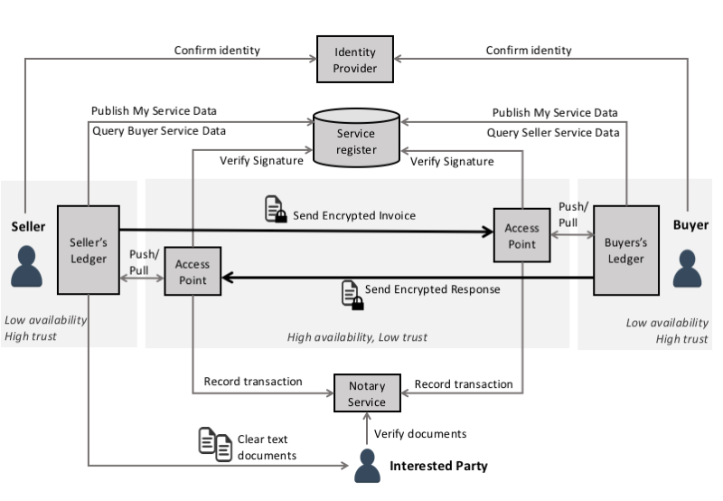

# Let's make business document exchange simple

## Purpose of this site

This site is for financial software developers and network service providers who would like to add support for the national e-invoicing framework to their products and services.  The [business case](/pages/business-case.md) for doing so is compelling.  

Established by the [Digital Business Council](http://digitalbusinesscouncil.com.au/), this site defines a suite of open standards and supporting test services that will allow invoices and (in future) other business documents to be securely exchanged between different financial software products;

 * As a business, I want to send electronic invoices to my customer systems and know the payment status so I can manage my cashflow and get cheap debtor financing if I need it.
 * As a business I want all invoices and tax receipts from my authorised suppliers to be automatically loaded to my financial system, ready for my approval so I can reduce my administration burden.

Electronic Document Exchange (EDI) is nothing new but has traditionally been complex, expensive, and implemented as hub-based and incompatible "islands of automation". Participants often have to connect to many traditonal EDI hubs in order to interact with their trading partners.  This site defines an alternative **peer-to-peer document** exchange framework that is semantically equivalent (and therefore interoperable) with legacy EDI but is based on modern and ubiquitous internet protocols such as REST, JSON, and OIDC. The result is a simpler, cheaper, and more secure framework.

All specification development is done as an open community processes based around the GitHub collaborative development environment using a transparent [governance model](/pages/governance-model.md) where any stakeholder is free to participate. 

* To contribute to the open development effort or keep a close watch on our work, please join the slack channel and github team for any of the technical or semantic specifications.
* To keep yourself informed, just sign up for our spam free <a href="http://eepurl.com/ctZ6hf">AusDigital general announcement</a> newsletter. 

## How it Works 

Unlike single provider APIs (eg google or facebook), a B2B community needs all businesses to implement the same interface so that the same document format (e.g. an invoice) can be sent from any business to any other business. The diagram shows how it works.  The technical and semantic specifications are positioned on the diagram via the blue and green tags.

1. A business that wishes to participate in the network first proves their identity via an OIDC "log in with.." an identity provider service.  Different identity assurance levels are supported in an open identity market as defined by the the **IDP** specification.  
2. With an IDP token at given identity assurance level, the business publishes their service end-point and public key to a metadata publisher in accordance with the **DCL** and **DCP** specifications.  So, for example, the the DCP will now show (with medium level of assurance) that "ACME" identified by ABN=12345678911 provides an e-invoice service at https://api.acme.com.au/v1/invoice 
3. ACME's supplier "Widget Co" has also verified identity and published their services to a **DCP** register. When Widget Co wants to send and invoice to ACME, then Widget Co will lookup ACME's service infomation (using ACME's ABN as the **DCL** lookup key).
4. Widget will create an invoice in accordance with the **BILL** specification then digitally sign it, then encrypt it using ACME's public key.  Then Widget will POST the invoice to ACME's service end point in accordance with the **TAP** (Transaction Access Point) specification.
5. ACME's **TAP** will receive the invoice and verify Widget's signature. ACME will get the invoice via the **TAP-GW** protocol, decrypt the invoice, and process it in ACME's financial system.   
6. At each key stage in the invoice lifecycle (received, approved/disputed, paid), ACME will send an invoice response document to Widget Co.
7. Both Widget and ACME will optionally record the signed invoices and responses in the blockchain using the Notary **NRY** specification.  This provides both a non-repudiable transaction audit log and can be used by authorised third parties to provide additional services like invoice financing (so Widget Co can get paid immediately even though ACME's terms are 60 days net). 
8. In most cases, all these steps 1 to 7 will be performed automatically by ACME's and Widget's financial software.  

The network infrastructure will be often provided by a network service provider (which implements all the blue technical specifications), leaving the ledger softwre to focus on the green semantic specifications and just consume the blue services.  The standardised **TAP-GW** protocol allows businesses like ACME or Widget Co to change network service providers at any time with minimal transfer cost, avoiding any lock-in to network service providers.  

The **JSON**  and **CODE** specification define some common foundation standards that all the semantic specifications (eg **BILL**, **PO**, and **SHIP**) depend upon.

The success of the interoperability framework depends on uptake by the ledger software providers. Those systems must implement a number of interfaces in a consistent way - which requires clear standards, good test services, and easy to use tooling.  That is the purpose of this site.
