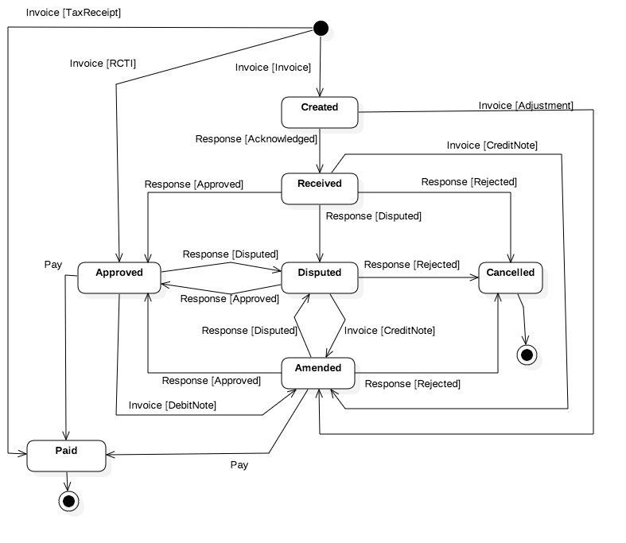

## Introduction

This document describes the AusDigital Billing Semantics (BILL) 1.0 Specification. TBA.

## Goals

TBA.

These are achieved by:

 * TBA.

## Status

This spec is an early draft for consultation.

This specification aims to support the Australian Digital Business Council
[eInvoicing initiative](http://ausdigital.org), and is under active
development at
[https://github.com/ausdigital/ausdigital-bill](https://github.com/ausdigital/ausdigital-bill).

Comments and feedback are encouraged and welcome. Pull requests with improvements are welcome too.

## Glossary

Phrase | Definition
------------ | -------------
ausdigital-bill/1 | This specification.
ausdigital-code/1 | Version 1 of the AusDigital [Code Lists Management](http://ausdigital.org/code-lists) specification.
ausdigital-syn/1 | Version 1 of the AusDigital [UBL Syntax(SYN)](http://ausdigital.org/syn) specification.
ausdigital-syn/2 | Version 2 of the AusDigital [UBL Syntax(SYN)](http://ausdigital.org/syn) specification.

This service depends on - TBA.

The TBA specification depends on this document. Note, TBA.
 
## Licence

Copyright (c) 2016 the Editor and Contributors. All rights reserved.

This Specification is free software; you can redistribute it and/or modify it under the
terms of the GNU General Public License as published by the Free Software Foundation; 
either version 3 of the License, or (at your option) any later version.

This Specification is distributed in the hope that it will be useful, but WITHOUT ANY
WARRANTY; without even the implied warranty of MERCHANTABILITY or FITNESS FOR A PARTICULAR
PURPOSE. See the GNU General Public License for more details.

You should have received a copy of the GNU General Public License along with this program;
if not, see [http://www.gnu.org/licenses](http://www.gnu.org/licenses).

 
## Change Process

 This document is governed by the [2/COSS](http://rfc.unprotocols.org/spec:2/COSS/) (COSS).

## Language

The key words "MUST", "MUST NOT", "REQUIRED", "SHALL", "SHALL NOT", "SHOULD", "SHOULD NOT", "RECOMMENDED", "MAY", and "OPTIONAL" 
in this document are to be interpreted as described in RFC 2119.

# Billing Process

## Invoice Document Profiles

 The Invoice document is used in six different process contexts, indicated using the UBL ProfileID.

 * Standard invoice from seller to buyer ("ProfileID":"dbc:invoice")
 * Updated standard invoice from seller to buyer that replaces a pervious invoice of the same ID ("ProfileID":"dbc:adjustment")
 * Recipient created tax invoice from buyer to seller ("ProfileID":"dbc:rcti")
 * Tax receipt sent from seller to buyer after payment has been made - usually for POS or online purchases ("ProfileID":"dbc:taxreceipt")
 * Credit note sent from seller to buyer that references an earlier standard invoice ("ProfileID":"dbc:creditnote")
 * Debit note sent from buyer to seller that references an earlier RCTI ("ProfileID":"dbc:debitnote")

The detailed business validation rules for each invoice profile are defined in [Validation Rules](#validation-rules).

## Document Response Codes

A UBL document response provides a means for the receiver party to update the sender on the processing state of the invoice.  The set of valid document response codes depends on the business process identified by the ProcessID (which is the same as the customizationID in UBL instances) are

 * Acknowledged - confirms receipt of the invoice (but does not imply approval to pay).
 * Approved - means that the payer has approved the invoice for (future) payment in accordance with payment terms.
 * Disputed - means that the payer has not accepted the invoice and will dispute some or all of the invoice.
 * Rejected - means that the payer has rejected the entire invoice and will not be paying.  

## State Lifecycle

The diagram shows the allowed set of states for an invoice as understood by both parties in the collaborative process.  Every transition from one state to another is triggered by the exchange of a business message - which could be either an invoice (one of six profiles) or a response document (with one of four response codes).

 * The TaxReceipt has the simplest lifecycle because it is just a record of a previous payment and so there is only a single invoice (profileID=taxreceipt) sent from seller to buyer and the state is "paid".  No document response needed.
 * The receipt of an RCTI (profileID=rcti) by a seller from a buyer takes the state directly to "approved" because this is a payer initiated transaction.  However the payer may subsequently send an invoice (profileID=debitnote) to make an adjustment to the rcti prior to eventual payment is accordance with payment terms.
 * The standard invoice that is a demand for future payment from seller to buyer is the most complex lifecycle because there can be 
  - various response documents indicating buyer processing status (acknowledged, approved, disputed, rejected)
  - a re-issue of the invoice with changes (profileID = adjustment) from seller to buyer - usually in response to a disputed status.
  - an issue of a credit note against an existing invoice (profileID = creditnote) - also usually in response to a disputed status.
  - an outright rejection of the invoice by the buyer which leads to a cancelled end-state.
 * The "success" end state in all cases is "paid" - indicated by the receipt of a payment record from a bank reconciliation file (outside of the scope of this specification).

# UBL Syntax 1.0 Billing Document Specifications

The billing process is supported by the invoice document (six variants) and the response document (four status codes) as described in the [billing process](#billing-process) model.  This section specifies the required invoice and response document models.

## Invoice Document

Is defined by the DBC [CoreInvoice XML Schema](https://github.com/ausdigital/ausdigital-bill/blob/master/resources/ausdigital-syn/1.0/spec/maindoc/CoreInvoice-1.0.xsd) library.

 * **[Invoice Samples](https://github.com/ausdigital/ausdigital-bill/tree/master/resources/ausdigital-syn/1.0/samples/Invoice/)**

## Response Document

Is defined by the DBC [Document Response XML Schema](https://github.com/ausdigital/ausdigital-bill/blob/master/resources/ausdigital-syn/1.0/spec/maindoc/Response-1.0.xsd) library.

 * **[Response Sample](https://github.com/ausdigital/ausdigital-bill/blob/master/resources/ausdigital-syn/1.0/samples/Response/SampleResponse-ConformantResponse.xml)**

The response document is a generic structure for all UBL document responses.  The generic response becomes a meaningful invoice response via the correct population of two key fields:
 * "profileID" which MUST be one of the 6 invoice profiles define in the [billing process](#invoice-document-profiles)
 * "statusReasonCode" which MUST contain one of the 4 values defined in the [invoice response codes](#document-response-codes) 
 

# UBL Syntax 2.0 Billing Document Specifications

The billing process is supported by the invoice document (six variants) and the response document (four status codes) as described in the [billing process](#billing-process) model.  This page specifies the required invoice and response document models.

## Invoice Document

Is defined by the [Invoice Schema](https://github.com/ausdigital/ausdigital-bill/blob/master/resources/ausdigital-syn/2.0/spec/Invoice.json) which is a simple single root JSON Schema that is a semantically equivalent representation of the DBC [CoreInvoice XML Schema](https://github.com/ausdigital/ausdigital-bill/blob/master/resources/ausdigital-syn/1.0/spec/maindoc/CoreInvoice-1.0.xsd) library.

 * **[Browsable Invoice Schema](http://ausdigital.org/docson.html#https://raw.githubusercontent.com/ausdigital/ausdigital-bill/master/resources/ausdigital-syn/2.0/spec/Invoice.json)**
 * **[Invoice Samples](https://github.com/ausdigital/ausdigital-bill/tree/master/resources/ausdigital-syn/2.0/samples/Invoice/)**

## Response Document

Is defined by the [Response Schema](https://github.com/ausdigital/ausdigital-bill/blob/master/resources/ausdigital-syn/2.0/spec/Response.json) which is a simple single root JSON Schema that is a semantically equivalent representation of the DBC [Document Response XML Schema](https://github.com/ausdigital/ausdigital-bill/blob/master/resources/ausdigital-syn/1.0/spec/maindoc/Response-1.0.xsd) library.

 * **[Browsable Response Schema](http://ausdigital.org/docson.html#https://raw.githubusercontent.com/ausdigital/ausdigital-bill/master/resources/ausdigital-syn/2.0/spec/Response.json)**
 * **[Response Sample](https://github.com/ausdigital/ausdigital-bill/blob/master/resources/ausdigital-syn/2.0/samples/Response/SampleResponse-ConformantResponse.json)**

The response document is a generic structure for all UBL document responses.  The generic response becomes a meaningful invoice response via the correct population of two key fields:

 * "profileID" which MUST be one of the 6 invoice profiles define in the [invoice document profiles](#invoice-document-profiles)
 * "statusReasonCode" which MUST contain one of the 4 values defined in the [invoice response codes](#document-response-codes)

# Validation Rules

Validation rules from the [ADBC eInvoicing Semantic Model](https://github.com/ausdigital/ausdigital-bill/blob/master/docs/1.0/eInvoicing_Semantic_Model_v1.0.pdf) are re-stated here but are broken down according to the invoice document usage context as identified by the ProfielID element.  

### Validation Rules - Common

| Rule | Mandatory | Optional | Extension |
|------|-----------|----------| ----------|
| An Invoice of more than $82.50 (including GST) to a GST-registered Buyer MUST be a Tax Invoice. | X | | |
| An Invoice must contain a Document Type Code | X | | |
| An Invoice MUST contain the Supplier’s Business Name or the ABN of the Supplier. | X | | |
| An Invoice with a Total Amount greater than $1000 MUST have either the Buyer's Business Name or the ABN of the Buyer. | X | | |
| An Invoice MAY contain the ABN plus a GST branch number for Suppliers with GST branches registered with the ATO. | | X | |
| An Invoice MUST contain an Invoice Issue Date. | X | | |
| An Invoice Line MUST have a Description.  | X | | |
| An Invoice MAY contain a Description of Properties of Invoiced Items.  | | X | |
| An Invoice Line MAY contain an Invoiced Quantity.  | | X | |
| An Invoice Line MUST contain the Invoice Line Extension Amount (Net Price multiplied by Invoiced Quantity) (excluding GST) for the Items sold.  | X | | |
| An Invoice MUST contain the sum total of all Invoice Line Extension Amounts. | X | | |
| An Invoice Line MUST contain the GST Amount for the Items sold or indicate the extent to which Items are taxable. | X | | |
| An Invoice Line MUST contain the Amount Payable (Invoice Line Extension Amount plus GST Amount) for the Items sold. | X | | |
| An Invoice Line MAY contain a GST Amount of zero. | | X | |
| An Invoice Line MAY specify a GST Category. | | X | |
| An Invoice MUST contain the Invoice level Tax Amount exclusive of GST. | X | | |
| An Invoice MUST contain the Invoice level GST Total Amount. | X | | |
| An Invoice MUST have an Invoice Identifier. | X | | |
| An Invoice MUST have a Supplier Business Name. | X | | |
| An Invoice MUST have a valid Document Type Code. | X | | |
| An Invoice MUST have an Issue Date. | X | | |
| An Invoice MAY have a Delivery Date. | | X | |
| An Invoice MAY have an Invoice Period. | | X | |
| An Invoice MAY have an Invoice Period Start Date. | | X | |
| An Invoice MAY have an Invoice Period End Date. | | X | |
| An Invoice End Period Date MUST be later or equal to an Invoice Period Start Date. | X | | |
| An Invoice MAY have a Sales Order Identifier. | | X | |
| An Invoice MAY have a Purchase Order Identifier. | | X | |
| An Invoice MAY have a Contact Identifier. | | X | |
| An Invoice MAY have an Electronic Address. | | | X |
| An Invoice MUST have at least one Invoice Line. | X | | |
| An Invoice Line Item MAY have a Suppliers Item Identifier. | | X | |
| An Invoice Line Item MUST have a Description. | X | | |
| An Invoice Line MAY have a Quantity. | | X | |
| An Invoice Line MAY have a Net Amount. | | X | |
| An Invoice Line MAY have a Dispatch Advice Identifier. | | X | |
| An Invoice Line MAY have a Receipt Advice Identifier. | | X | |
| An Invoice Line MAY have a delivery Address. | | | X |
| An Invoice Line Item MAY have a Country of Origin. | | | X |
| An Invoice MAY have one or more Document References. | | X | |
| The Invoice Level Net Amount MUST be equal to the sum of Invoice Line Net Amounts. | X | | |
| The Invoice Level Allowance Amount MUST be equal to the sum of Invoice Line Allowances plus any Invoice Level Allowances. | X | | |
| The Invoice Level Charge Amount MUST be equal to the sum of Invoice Line Charges plus any Invoice Level Charges. | X | | |
| The Invoice Level Net Amount MUST be equal to the Invoice Level Gross Amount - Invoice Level Allowance Amount + Invoice Level Charge Amount. | X | | |
| The Invoice Level GST Amount MUST be equal to the sum of Invoice Line GST Amounts. | X | | |
| The Invoice Level Total Amount MUST be equal to the Invoice Level Net Amount + the Invoice Level Tax Amount. | X | | |
| An Invoice MAY have an Amount Payable. | | X | |
| An Invoice MUST have an Invoice Level Total Amount. | X | | |
| An Invoice MAY have an Invoice Level Net Amount. | | X | |
| An Invoice MAY have a Related Invoice Identifier. | | X | |
| An Invoice MAY have an Amount Payable. | | X | |
| An Invoice MAY have one or more Document References. | | X | |
| An Invoice Level Total Amount MUST be greater than 0. | X | | |
| An Invoice Line MAY have a Net Amount. | | X | |
| An Invoice Line Extended Amount after all allowances and charges MUST NOT be negative. | X | | |
| An Invoice Line Price MUST be 0 or more. | X | | |
| An Invoice Line Item MUST have a Net Price. | X | | |
| An Invoice Line MAY have a Quantity. | | X | |
| An Invoice MAY have an Allowance Rate and Base Amount at Invoice Level. | | X | |
| An Invoice Level Allowance MUST be greater than 0. | X | | |
| An Invoice Level Allowance MAY have a GST Category. | | X | |
| An Invoice Level Allowance Reason Description MUST match the Invoice Level Allowance Reason Code (if any). | X | | |
| An Invoice MAY have a Charge Rate and Base Amount at Invoice Level. | | X | |
| An Invoice Level Charge MUST be greater than 0. | X | | |
| An Invoice Level Charge MAY have a GST Category. | | X | |
| An Invoice Level Charge Reason Description MUST match the Invoice Level Charge Reason Code (if any). | X | | |
| An Invoice Line MAY have an Allowance Rate and Base Amount. | | X | |
| An Invoice Line Allowance MUST be greater than 0. | X | | |
| An Invoice Line Allowance MUST have an Allowance Reason Description. | X | | |
| An Invoice Line Allowance Reason Description MUST match the Invoice Line Allowance Reason Code (if any). | X | | |
| An Invoice Line MAY have a Charge Rate and Base Amount. | | X | |
| An Invoice Line Charge MUST be greater than 0. | X | | |
| An Invoice Line Charge MUST have a Charge Reason Description. | X | | |
| An Invoice Line Charge Reason Description MUST match the Invoice Line Charge Reason Code (if any). | X | | |
| A Payment Means MUST have a valid Payment Means Type Code. | X | | |
| A Payment Means Financial Institution Account Identifier MUST have Financial Institution Identifier. | X | | |
| A Payment Means for a card payment MUST state the last 4 to 6 digits of the Financial Institution Account Identifier. | X | | |
| An Invoice MUST have a Payee Business Name if Payee Business Name is not the same as the Suppliers Business Name. | X | | |
  
### Validation Rules - "ProfileID":"Invoice"

| Rule | Mandatory | Optional | Extension |
|------|-----------|----------| ----------|
| A Tax Invoice for goods or services that do not all include GST (mixed supplies) shall indicate which goods or services do not include GST. | X | | |
  
### Validation Rules - "ProfileID":"rcti"

| Rule | Mandatory | Optional | Extension |
|------|-----------|----------| ----------|
| A Recipient Created Tax Invoice MUST contain either the Business Name or the ABN of the Buyer. | X | | |
| A Recipient Created Tax Invoice MUST contain the Payee Name if GST is payable. | X | | |
| A Recipient Created Tax Invoice MAY contain the following statement: “The recipient and the supplier declare that this agreement applies to supplies to which this tax invoice relates. The recipient can issue tax invoices in respect of these supplies. The supplier will not issue tax invoices in respect of these supplies. The supplier acknowledges that it is registered for GST and that it will notify the recipient if it ceases to be registered. The recipient acknowledges that it is registered for GST and that it will notify the supplier if it ceases to be registered for GST. Acceptance of this RCTI constitutes acceptance of the terms of this written agreement. Both parties to this supply agree that they are parties to an RCTI agreement. The supplier agrees to notify the recipient if the supplier does not wish to accept the proposed agreement within 21 days of receiving this document.” | | X | |
  
### Validation Rules - "ProfileID":"taxreceipt"
 tbd
  
### Validation Rules - "ProfileID":"adjustment"

| Rule | Mandatory | Optional | Extension |
|------|-----------|----------| ----------|
| An Invoice MUST contain a Document Type Code indicating it is an adjustment document. | X | | |
  
### Validation Rules - "ProfileID":"creditnote"

| Rule | Mandatory | Optional | Extension |
|------|-----------|----------| ----------|
| A Credit Note MAY have a Related Invoice Identifier. | | X | |
| A Credit Note MAY have a Total Amount. | | X | |
| A Credit Note MAY have a Buyer Accounting Reference. | | X | |
| The Credit Note Total Amount MUST be greater than 0. | X | | |
| A Credit Note Line MAY have a Net Amount. | | X | |
| The Credit Note Line Net Price MUST NOT be negative. | X | | |
| A Payment Means Type Code for a Credit MUST have a Financial Institution Account Identifier. | X | | |
  
### Validation Rules - "ProfileID":"debitnote"

 tbd
 
# Related Material

 * ADBC eInvoicing Semantic Model (v1.0, available [here](https://github.com/ausdigital/ausdigital-bill/blob/master/docs/1.0/eInvoicing_Semantic_Model_v1.0.pdf)), which provides background to the [AusDigital](http://ausdigital.org) community process.
 * [GitHub issues](https://github.com/ausdigital/ausdigital-bill/issues/) for collaborating on the development of the BILL.
 * A reference [BILL service](https://bill.testpoint.io/) (for testing and development purposes).
 * Free, Open-Source Software [BILL implementation](https://github.com/test-point/testpoint-bill).
 * An automated [DCL test suite](https://github.com/test-point/testpoint-bill).
