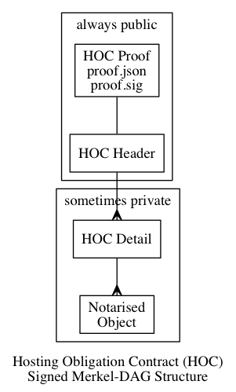

 * Spec ID: ausdigital.org/ausdigital-nry/1.0
 * 
 * Editor: [Chris Gough](mailto:christopher.d.gough@gmail.com)
 * Contributors:

# AusDigital Notary (NRY) 1.0 Specification
 
This document describes the Notary (NRY) specification, which provides an irrefutable
history of a specific "contract" (e.g. an invoice and it's status lifecycle), pegged to
a blockchain distributed ledger. This service supports dispute resolution and provides
the foundation platform for financial services such as debtor financing. Notarisation
also makes it possible for the business system to audit the reliability of any TAP
Gateway that it uses.


## Goals

Facilitate features in the TAP protocol that:

 * Prevent post-hoc "Fraud of Commission" (retrospective creation of false document history).
 * Prevent post-hoc "Fraud of Ommission" (surrupticious destruction of legitimate document history).


Balance information security with utility:

 * Sufficient public data for transaction stakeholders to independently verify integrity of shared-secret documents.
 * Information from private documents is not leaked into the public domain, even in a future where tools exist to overcome contemporary cryptographic methods.
 * Ensure notarised object sources are identified (to a known and meaningfull level of identity assurance), but do not leak information about subjects that could be used to anlayse communication or transaction traffic.
 * Publically auditable (transparent), to enalble notary reputation to be based on independent performance evaluation using transparent, non-repudiable and objective data. In adition to the relevent data being open, the cost of monitoring and verifying the activities of a notary must not be prohibitive.


Sustainable and secure infrastructure:

 * Socially responsible, blockchain-efficient public storage of existance proofs. This means low externalised community cost (impact on the shared ledger) even if a very large number of objects are notarised in a given time frame.
 * Leverage the strongest consensus product available (maximise resistance to Sybl attacks).
 * Leverage the most efficient proof market available (minimise cost of proof at the given consensus-strength).
 * Avoid single point of failure in the network that stores and distributes existance proof.
 * 


These are achieved by:

 * Notarising all objects (in a timeframe) into a proscribed Merkel-DAG data structure that is pegged to the Blockchain with a single record, which references a minimal signed proof document that can be verified before accessing a significant data volumes.
 * Distributing the pegged Merkel-DAG proof structure with a decentralised, content-addressable memory system (modelled on and compatible with the Inter Planetary File System, IPFS).
 * Avoid propietary blockchains. Adopt the largest public blockchain with the highest market capitalisation (BitCoin), thereby sourcing work-proof from an open market of commodity mining services and multiple open source -oftwaresimplementations.


## Status

This spec is an early draft for consuiltation.

This specification aims to support the Australian Digital Business Council
[eInvoicing initiative](http://ausdigital.org), and is under active
development at
[https://github.com/ausdigital/ausdigital-nry](https://github.com/ausdigital/notary).

Comments and feedback are encouraged and welcome. Pull requests with improvements are welome too.


## Glossary

Phrase | Definition
------------ | -------------
ausdigital-nry/1 | This specification.
ausdigital-dcl/1 | Version 1 of the [AusDigtial](http://ausdigital.org) [Digital Capability Lookup (DCL)](https://ausdigital-dcl.readthedocs.io) specification
ausdigital-dcp/1 | Version 1 of the AusDigtial [Digital Capability Provider (DCP)](https://ausdigital-dcp.readthedocs.io) specification
ausdigital-idp/1 | Version 1 of the AusDigital [Identity Provider (IDP)](https://ausdigital-idp.readthedocs.io) specification.
ausdigital-tap/1 | Version 1 of the AusDigital [Transaction Access Point(TAP)](http://ausdigital.org/transaction-access-point) specification.

This service depends on `ausdigital-dcl/1`, `ausdigital-dcp/1` and `ausdigital-idp/1`.

The `ausdigital-tap` specification depends on this document. Note, while this specification describes a generic notary interface, the TAP specification provides further restriction on the use of the notary.
 

## Licence

Copyright (c) 2016 the Editor and Contributors. All rights reserved.

This Specification is free software; you can redistribute it and/or modify it under the
terms of the GNU General Public License as published by the Free Software Foundation; 
either version 3 of the License, or (at your option) any later version.

This Specification is distributed in the hope that it will be useful, but WITHOUT ANY
WARRANTY; without even the implied warranty of MERCHANTABILITY or FITNESS FOR A PARTICULAR
PURPOSE. See the GNU General Public License for more details.

You should have received a copy of the GNU General Public License along with this program;
if not, see [http://www.gnu.org/licenses](http://www.gnu.org/licenses).


## Change Process

This document is governed by the [2/COSS](http://rfc.unprotocols.org/spec:2/COSS/) (COSS).


## Language

The key words "MUST", "MUST NOT", "REQUIRED", "SHALL", "SHALL NOT", "SHOULD", "SHOULD NOT",
"RECOMMENDED", "MAY", and "OPTIONAL" in this document are to be interpreted as described in
RFC 2119.


# Application Programming Interface

The notary MUST privide a REST/JSON API, which can be used for two purposes:

 * POST methods that task the notary with notarising a digital record (this may or may not involve storing the object in the notary's archive).
 * GET methods that access notarised data from the notary's archive (this may or may not require authentication, and may or may not be subject to content-based access control rules)

Perhaps unsurprisingly, the notary API does not generally furnish any PUT, PATCH or DELETE methods. Notary records are imutable until disposal, which is scheduled at the time of notarisation.

Notary records are addative; the only way to change the parameters of notarisation is to make a subsequent notarisation request with different parameters (the notary will meet obligations of both requests).

The notary API is comprised of two REST/JSON resources, `/public/` and `/private/`. These work in similar ways, but have different access control rules. Separate endpoints are used (rather than a parameter) to minimise risk of accidentialy publishing private objects ("poka-yolk" principle).

Implementations  MAY be allow users to restrict client access to one or the other endpoint on a per-API token basis.


| Verb   | /public/*               | /private/*              |
|--------|-------------------------|-------------------------|
| GET    | no token required       | token + ACL             |
| POST   | token + ACL             | token + ACL             |
| PUT    | generally not available | generally not available |
| PATCH  | generally not available | generally not available |
| DELETE | generally not available | generally not available |


The Notary API is a REST/JSON protocol, layered on HTTP. Implementations:

 * MUST use HTTPS (RFC2818).
 * MUST use Content-Type: multipart/form-data (RFC2388)
 * MUST NOT use Content-Type: application/x-www-form-urlencode (RFC1876 is NOT supported)
 * MAY explicitly declare Content-Transfer-Encoding: base64
 * MUST NOT rely on notary semantic information in HTTP headers


## POST object to Notary

The POST verb is used to request notarisation. The posted body contains two parts, `object` and `parameters`.

Posting an object to the `/public/` or `/private/` notary resource causes the notary business to incur cost and obligation. The notary may refuse, or may agree under commercial terms. For this reason, POST requests always must be authenticated with a JWT header issued under the `ausdigital-idp/1` specification.

Assuming the current working directory contains the object (as `object.foo`) and parameters (as `param.json`), the following curl command will post the message to the notary endpoint:

```bash
curl -X POST \
 -H "Content-Type: multipart/form-data" \
 -H "Authorization: Bearer <API_TOKEN>" \
 -F "object=@object.foo" \
 -F "parameters=@param.json" \
 <NRY_URL>
```

(Replace <NRY_URL> with HTTPS URL discovered from the Digital Capability Publisher of the business providing the Notary Service, and replace <API_TOKEN> with the JWT issued by the `ausdigital-idp/1` Identity Provider).

The protocol places no physical restriction on the `object.foo` POSTed to the notary API, however there may be some practical limits from the underlying HTTP infrustructure. For example, there may be some limit to the maximum file size than can be reliably POSTed.

The `param.json` file:

 * MUST be a JSON file that is valid per [`nry_post_param.schema`](https://github.com/ausdigital/ausdigital-nry/blob/master/docs/resources/1.0/spec/nry_post_param.schema) JSON schema.
 * MUST contain a `DURABILITY` attribute that is an ISO 8601 formatted date string
 * The `DURABILITY` date MUST be not less than one month in the future
 * MUST contain a `NETWORK` attribute that is a valid business identifier URN per `ausdigital-dcp/1` specification.
 * MUST contain an `AC_CODE` attribute, that is a non-negative integer.
 * MAY contain an `RESTRICT_LIST` attribute, that is a JSON list of zero or more elements that are valid business identifier URNs per `ausdigital-dcp/1`.
 * If the `NETWORK` value is a business identifier of the notary itself, then the `AC_CODE` MUST be interpreted per `ausdigital-nry/1`. 
 * If the `NETWORK` value is not a business identifier of the notary, the `AC_CODE` MAY be interpreted as `AC_CODE` = 3.
 * If the `NETWORK` value is not a business identifier of the notary, the notary MAY silently fail to store the notarised object.
 * If the `NETWORK` value is not a business identifier of the notary, the Notary API resource must be `/private/` (alternate `NETWORK`s MUST NOT be used with the `/public/` resource). 
 * If the Notary API resource is `/public/`, the `AC_CODE` must be 0.
 * If the `AC_CODE` is 1, 2 or 3 (or may be interpreted as 3), the Notary API resource must be '/private/'.


When the notary recieves a valid notarisation request, if it does not refuse the request and does not experience technical difficulties, then it MUST:

 * place notarised object in a system of record (unless the `param.json` `NETWORK` value is not a business identifier of the notary, in which case the notary MAY place the notarised object in a system of record)
 * reference API Spec (return HTTP 200 response code, headers, etc)
 * return HTTP body that is JSON document that is valid per `nry_post_response.schema` JSON schema.
 * The body must contain a DOC_ID attribute containing a verifyable content-address of the notarised object, using a hash and encoding scheme that is a valid IPFS address.


When the notary recieves an invalid notarisation request, or if it recieves a valid request that it choses to refuse, or if it experiences technical difficulties, then it:

 * MUST return an appropriate HTTP response code (see swagger specification)
 * The body MUST NOT contain a DOC_ID attribute
 * etc... TODO

The DOC_ID returned in the body of successful POSTs (HTTP code 200 responses) is a valid content identifier. This DOC_ID is subsequently used as notarised object identifier in blockchain Gazettal. It is also the DOC_ID used in `GET /public/{DOC_ID}/` and `GET /private/{DOC_ID}/` API calls.
  

## Search Notary Archives

There are two search interfaces:

 * `GET /public/?{filter}/`
 * `GET /private/?{filter}/`

Both return a list of DOC_IDs that match the `{filter}`.

 * The `GET /private/?{filter}/` form MUST use an API token issued by an `ausdigital-idp/1` Identity Provider.
 * The `GET /public/?{filter}/` form MAY use an API token.


The filter may inclued the following parameters:

 * `restrict_list=<STR>`, where <STR> is a comma separated list of URN business identifiers per `ausdigital-dcp/1`. This filter is applied to businesses in the RESTRICT_LIST POST parameter of the objects. Where multiple URNs are provided, they are combined with logical AND. This parameter is optional, if not supplied the business identifier claim in the API Token JWT is used (meaning "restrict to message I am authorised to see")
 * `submitted_after=<STR>`, where <STR> is an ISO 8601 datetime. Only objects after this datetime will be returned.
 * `submitted_before=<STR>`

If the `restrict_list` filter is specified, but the business identifier claim in the JWT is not included in the `restrict_list` filter, then the API MUST return an 403 error response.


## Access Notarised Objects

If the DURABILITY datetime of the notarise object is now or in the future:

 * Any DOC_ID listed in the response from a `GET /public/?{filter}` query MUST be available with `GET /public/{DOC_ID}/`
 * Any DOC_ID listed in the response from a `GET /private/?{filter}` query MUST be available with `GET /private/{DOC_ID}/`, if the same API token is used for both queries.
 * The notarised object MAY also be available via IPFS using the `/ipfs/{DOC_ID}` address.

If the DURABILITY datetime of the notarised object is in the past:

 * Any DOC_ID listed in the response from a `GET /public/?{filter}` query MAY be available with `GET /public/{DOC_ID}/`, or it MAY return an HTTP 404 response.
 * Any DOC_ID listed in the response from a `GET /private/?{filter}` query MAY be available with `GET /private/{DOC_ID}/` (if the same API token is used for both queries), or it MAY return an HTTP 404 response.
 * The notarised object MAY also be available via IPFS using the `/ipfs/{DOC_ID}` address.


# Blockchain Gazettal

Periodically, the Notary:

 * Generates a Multi-Part Hosting Obligation Contract (Full HOC) describing archived records
 * Makes timely public commitment to store and publish archived objects under the terms of the HOC

The Full HOC is a four layer Directed Acyclic Graph (DAG) comprised of JSON files, where each layer references the lower layer by cryptographic hash of its contents, making it a "Merkel-DAG" structure.

Each document in this Merkel-DAG has a specific purpose. Some parts of the structure are always public (first two layers, HOC Proof and HOC Header). Other parts may or may not be public depending on the application (HOC Detail and Notarised Object).



The public parts of the HOC are published in a directory-like structure with a content-address in its path. Two parts have fixed names (`proof.json` and `proof.sig`), while all the other parts names are consistent with their content-addresses (meaning the file name is equivalent to the IPFS address of the file contents).

Content-addressing is consistent with the IPFS content-addresses format, for example `QmNn2peeUaJFxnPVsFjriVxnPZKkh4y2EfRqpEHQ8EYXQr`. Content addresses may refer to individual files or directory-like collections of files (and subdirectories, recursively).

The following examples assume that this address is the address of the directory-like structure that has been gazetted in the blockchain:

 * `/ipfs/QmYwAPJzv5CZsnA625s3Xf2nemtYgPpHdWEz79ojWnPbdG/`


## HOC Proof

The HOC Proof is used to validate the Full HOC prior to potentially intensive computation or network activity. 

To ensure efficient auditability of notaries, an independent observer should be able to parse the blockchain and extract `OP_RETURN` transactions that look like IPFS addresses. For each IPFS address-like record found, the observer should be able to ignore invalid HOCs cheaply. The purpose of the HOC Proof is to provide a compact and verifiable reference to the HOC_HEAD document (which may be less compact).

 * The Gazetted address MUST contain a HOC Proof, comprised of two files, `proof.json` and `proof.sig`.
 * `proof.json` MUST be valid per the `proof.schema` JSON schema specification.
 * `proof.json` MUST contain a PROTOCOL attribute, which identifies the protocol for processing the Merkel-DAG. The value of the PROTOCOL attribute MUST be `ausditigal-nry/1.0`.
 * `proof.json` MUST contain a SIG_DATE attribute containing an ISO 8601 formatted date and time string identifying when the notary notionally created the `proof.sig`
 * `proof.json` MUST contain a NOTARY attribute, which references the business identifier of the notary in URN format consistent with AusDigital DCL and DCP specifications.
 * `proof.json` MUST contain a `PUB_KEY` attribute, which contains a public key (**TODO**: what format? how encoded?)
 * The public key in the `PUB_KEY` attribute of `proof.json` MUST be published in the DCP entry of the NOTARY business, as a valid (not revoked) key on SIG_DATE
 * `proof.sig` MUST be a valid signature of `proof.json`, using the public key identified in `proof.json`
 * `proof.json` MUST contain a DURABILITY attribute, the value of which is an ISO 8601 formatted date and time string.
 * The DURABILITY date MUST be later than SIG_DATE by no less than one month.
 * The NOTARY MUST commit their reputation to the availability of the HOC until the DURABILITY date.
 * `proof.json` MUST contain a HOC_HEAD attribute with a value that is a valid content-address hash.


### Validating HOC Proof

The first step in validating the Merkel-Dag is to check that the proof.json exists and is no larger than MAX_SIZE.

For example, assuming the blockchain contains `/ipfs/QmYwAPJzv5CZsnA625s3Xf2nemtYgPpHdWEz79ojWnPbdG/`, the validation begins with:

 * test for the existence of `/ipfs/QmYwAPJzv5CZsnA625s3Xf2nemtYgPpHdWEz79ojWnPbdG/proof.json`
 * if the proof.json is larger than `MAX_SIZE`, it is not valid. There is no need to download more than `MAX_SIZE + 1 byte` in this step.
 * test for the existence of `/ipfs/QmYwAPJzv5CZsnA625s3Xf2nemtYgPpHdWEz79ojWnPbdG/proof.sig`
 * if the proof.sig is larger than `MAX_SIZE`, it is not valid. There is no need to download more than `MAX_SIZE + 1 byte` in this step.

If `proof.json` and `proof.sig` both exist and neither exceed MAZ_SIZE, the next step is to ensure that `proof.json` validates agains the json schema. Assuming `proof.json` and `proof.schema` are both in the current working directory, the `jsonschema` program could be used like this:

```bash
jsonschema -i proof.json proof.schema
```

If the schema is valid, it will have a `NOTARY` element containing the business identifier of the party responsible for notarisation. The value of this attribute is a business identifier which can be resolved via the AusDigital [Digital Capability Lookup](https://ausdigital-dcl.readthedocs.io), which will yield an AusDigital [Digital Capability Provider](https://ausdigital-dcp.readthedocs.io) where the public keys of that organisation can be discovered.

Note:

 * Multiple public keys may be associated with a business in the DCP register
 * The value of the `PUB_KEY` attribute in `proof.json` MUST be listed in the DCP entry for the NOTARY
 * The DCP listing of the `PUB_KEY` signature MUST NOT have a PUBLISHED date later than the SIG_DATE attribute in `proof.json`
 * If the `PUB_KEY` is revoked in the DCP entry for the NOTARY, it MUST NOT be revoked before the value of SIG_DATE attribute in `proof.json`

If, using NOTARY identifier and the DCL/DCP mechanism, the `PUB_KEY` can not be shown to be valid (non-revoked) public key of the notary on SIG_DATE, then `proof.json` is not valid.

If the public key is valid (and saved as `notary_pub.key`), you may import it to the GnuPG program like this:

```bash
gpg2 --import notary_pub.key
```

If the public key is valid, the next step is to confirm that `proof.sig` is in fact a digital signature of `proof.json` which was made with the private key corresponding to the `PUB_KEY` attribute of `proof.json`.

Assuming you have imported the verified valid key into the GnuPG program, and have `proof.json` and `proof.sig` in your present working directory, you can confirm the signature like this:

```bash
gpg2 --verify proof.sig proof.json
```

After verifying proof.json with proof.sig, it is safe to process the HOC Header


## HOC Header

The HOC Header is processed after the HOC Proof has been validated. It is essentially an arbitrarily long list of references to HOC Detail records. It also contains metadata about access and availability of HOC Detail records.

 * The Full HOC (directory-like content-address, gazetted to the blockchain) MUST contain a file with a valid content-address, that is referenced by the `HOC_HEAD` attribute of `proof.json` (the `HOC_HEAD` file)
 * The contents of the `HOC_HEAD` file MUST be json that is valid per `hoc_head.schema` JSON schema
 * `HOC_HEAD` MUST contain a list of one or more elements.
 * Each element in `HOC_HEAD` list MUST contain a `HOC_DETAIL`attribute, which is a valid content-address of a file.
 * Each element in `HOC_HEAD` list MUST contain a DURABILITY attribute.
 * The value of DURABILITY attribute MUST be an ISO 8601 formatted string describing the DATE until which the HOC Detail is promised available.
 * Each element in `HOC_HEAD` list MUST contain a `NETWORK` attribute.
 * The value of `NETWORK` attribute MUST be a valid business identifier URN per the DCP and DCL specifications.
 * Each element in `HOC_HEAD` list MUST contain a `AC_CODE` attribute.
 * The value of `AC_CODE` MAY be an empty string.
 * The HOC Header MAY be published directly with its content-address (e.g. `/ipfs/QmNn2peeUaJFxnPVsFjriVxnPZKkh4y2EfRqpEHQ8EYXQr`).
 * The HOC Header MUST be published with its content-address as its name within the directory-like collection that was gazetted to the blockchain (e.g. `/ipfs/QmYwAPJzv5CZsnA625s3Xf2nemtYgPpHdWEz79ojWnPbdG/QmNn2peeUaJFxnPVsFjriVxnPZKkh4y2EfRqpEHQ8EYXQr`).

The `AC_CODE` partially defines the protocol for accessing the record referenced in the `HOC_DETAIL` attribute. The meaning of the `AC_CODE` is dependent on the `NETWORK`. In other words, the `AC_CODE` is interpreted in the context of the `NETWORK`.

Because the network is a business identifier URN, the `AC_CODE` interpretation context can be determined by DCP query...

If the `NETWORK` is the URN of the notary, the DCP lookup of RECORD_ACCESS_PROTOCOL MUST return `ausdigital-nry/1` or higher version. Otherwise they can be anything (including undefined).


If the DCP document type / process type of the `HOC_HEADER` list item's `NETWORK` is `ausdigital-nry/1`, then the allowable value of `AC_CODE` are:

| Access Protocol | `AC_CODE` | HOC Detail | Notarised Object | Comment                         |
|-----------------|---------|------------|------------------|---------------------------------|
| ausdigital-nry/1 | 0      | Public     | Public           | Transparently auditable open data (e.g. public HOC documents). |
| ausdigital-nry/1 | 1      | Public     | Private          | Independently auditable secret data (e.g. business transaction records, such as eInvoices). |
| ausdigital-nry/1 | 2      | Private    | Public           | Plausibly auditable open data (that can be subsequently rendered transparently auditable by publishing the HOC Detail). |
| ausdigital-nry/1 | 3      | Private    | Private          | Privately auditable secret data (e.g. Corporate records). |
| [other] | [any] | [either] | [either] | If Access Protocol is not `ausdital-nry/1` (or later), arbitrary (locally meaningful) `AC_CODE` may be used. |


### Validating HOC Header

note: this can be cached: when processing a HOC Header, the value of DCP lookups MAY be assumed not to change between `HOC_HEADER` list items.

For each `HOC_HEADER` list item:

 * If the `NETWORK` is not equal to the `proof.json` NOTARY, and if DCP lookup of RECORD ACCESS PROTOCOL for the `NETWORK` does not resolve to `ausdigital-nry/1`, then this specification does not describe how to validate that `HOC_DETAIL` record. Refer to the appropriate protocol specification for interpretation of `AC_CODE` values in that context. Do not proceed with validating the listed HOC Header or any HOC Details it seems to refer to (even if the syntax seems identicacompatabledwith tal-nry/1` protocol).

If the `NETWORK` is equal to the `proof.json` NOTARY, or if the DCL lookup of RECORD ACCESS PROTOCOL for the `NETWORK` resolves to `ausdigital-nry/1`, then apply the following validation rules:


If `AC_CODE` is 0 or 1:

 * If the `HOC_HEADER` item DURABILITY is a future date, the content-address MUST be directly available (for example `/ipfs/QmNn2peeUaJFxnPVsFjriVxnPZKkh4y2EfRqpEHQ8EYXQr`
 * If the `HOC_HEADER` item DURABILITY is a future date, and the `proof.json` DURABILITY is also a future date, the content address MUST be available within the directory-like container of the Full HOC (for example `/ipfs/QmYwAPJzv5CZsnA625s3Xf2nemtYgPpHdWEz79ojWnPbdG/QmNn2peeUaJFxnPVsFjriVxnPZKkh4y2EfRqpEHQ8EYXQr`)


If `AC_CODE` is 2 or 3:

 * If the `HOC_HEADER` item DURABILITY is a future date, and the API Token has valid identity claim, the content-address MAY be available via the notary API (`GET /private/{content_address}`).
 * If the `HOC_HEADER` item DURABILITY is a future date, and the API Token has valid identity claim, and the API Token identity claim matches the `proof.json` NOTARY, the content-address MUST be available via the notary API (`GET /private/{content_address}/`).
 To the business identity of the `NETWORK`, the content-address MUST be available via the notary API (`GET /private/{content_address}`).


When notarised objects are submitted to the notary API with `AC_CODE` 1, 2 or 3 (e.g. `POST {object+params} /private/`), the `RESTRICT_LIST` parameter contains a list of business identifiers permitted to access the object. This RESTRICT_LIST lists the business identifiers of all parties with rights to access the record.

When notarised objects are submitted to the notary API with `AC_CODE` 1, the `RESTRICT_LIST` attribute only applies to the notarised object. When notarised objects are submitted to the notary API with `AC_CODE` 2 or 3, the `RESTRICT_LIST` parameter MUST be applied to both the `HOC_DETAIL` and the notarised object. This means:

 * If the `HOC_HEADER` item DURABILITY is a future date, and the API Token has valid identity claim, and the API Token identity claim matches one of the identities in the records `ESTRICT_LIST`, and the `AC_CODE` is 3, then the `HOC_DETAIL` content-address MUST be available via the notary API (`GET /private/{content_address}/`)
 * If the `HOC_HEADER` item DURABILITY is a future date, and the API Token has valid identity claim, and the `AC_CODE` is 1, 2 or 3; then the `HOC_DETAIL` content-address MUST be available via the notary API (`GET /public/{content_address}/`)
 * **TODO**: cross reference API spec (request notarisation on the API)
 * **TODO**: ensure API spec includes `AC_CODE` parameter (validate if /private/ `AC_CODE` in (2,3), if /public/ `AC_CODE` in (0,1), if `AC_CODE==0` `RESTRICT_LIST` empty (no restrictions), if `AC_CODE!=0` `RESTRICT_LIST` must not be empty).


### Notary Reputation

Once a `proof.json` has been validated, the availability (or otherwise) of the HOC Header, within the timeframe of `proof.json` DURABILITY, this MAY be considered to impact the objective reputation of the Notary.

The availability or otherwise of HOC Headers may or may not be directly related to the objective global reputation of the Notary.

 * If the `HOC_HEAD.NETWORK` is a URN of the same business as the `proof.json` NOTARY, and if the `RECORD_ACCESS_PROTOCOL` of that business (DCP lookup) is not `ausdigital-nry/1` (or later version), then the notary has absconded their responsibility. This MAY have a strongly negative impact on the reputation of the notary.
 * If the `HOC_HEAD.NETWORK` is a URN of a different business as the `proof.json` NOTARY, the availability or otherwise of `HOC_DETAIL` (and notarised objects) MUST NOT be interpreted as impacting the reputation of either business.
 * The DURABILITY date/time represents the limit of promised availability of the notarised object.
 * If the `HOC_DETAIL` `NETWORK` is the same business as NOTARY, that means the Notary is taking responsibility for the promise of availability. Failure to meet terms of `AC_CODE` and DURABILITY will detrimentally impact the reputation of the Notary.
 
If the `HOC_HEAD.NETWORK` identifies a business other than the `proof.json` NOTARY, the DURABILITY and `AC_CODE` represent claims (by the notary) about promises made by another business. The reason these MUST NOT be interpreted as impacting the objective reputation of either party is that it is impossible to distinguish false claims from true claims and broken promises.

In addition to global objective notary reputation (which can be based on transparently auditable open data), organisations with privileged access to the notary API (through RESTRICTION_LIST privileges to `AC_CODE` "1", "2" and "3" notarised objects and `AC_CODE` "2" and "3" `HOC_DETAIL` records) may produce private objective reputation scores.


## HOC Detail

The HOC Detail is a JSON document of arbitrary size, referenced by its content-address in the HOC Header list.

 * The HOC Detail MUST contain a list of one or more elements.
 * The HOC Detail MUST be validated against the `hoc_detail.schema` JSON schema.


Every element in the HOC Detail list:

 * MUST contain a DURABILITY attribute, which contains an ISO 8601 formatted date string.
 * The DURABILITY date MUST NOT be less than one month ahead of the `proof.json` SIG_DATE attribute.
 * The DURABILITY date MUST NOT be less than the corresponding `HOC_HEADER` durability date.
 * MUST contain an OBJECT attribute, which contains a content-address of some notarised object. 

The elements in the HOC Detail inherits an `AC_CODE` and `NETWORK` from the reference to the HOC Detail in the HOC Header.

 * If the inherited `AC_CODE` is "0", and `proof.json` NOTARY identifies the same business as the inherited `NETWORK`, and the listed DURABILITY date is in the future, then the OBJECT this HOC Detail must be available through the API (e.g. `GET /public/{content_address}`)
 * If the inherited `AC_CODE` is "1", "2" or "3"; and `proof.json` NOTARY identifies the same business as the inherited `NETWORK`, and the listed DURABILITY date is in the future, and the API Token has a valid identity claim, and the identity in the API token identifies a business in the RESTRICT_LIST of the object, then the OBJECT this HOC Detail MUST be available through the API (e.g. `GET /private/{content_address}`)

 
 # Related Material

 * [GitHub issues](https://github.com/ausdigital/ausdigital-nry/issues/) for collaborating on the development of the NRY.
 * A reference [NRY service](http://testpoint.io/nry) (for testing and development purposes).
 * Free, Open-Source Software [NRY implementation](https://github.com/test-point/testpoint-nry).
 * An automated [NRY test suite](https://github.com/test-point/testpoint-nry).
