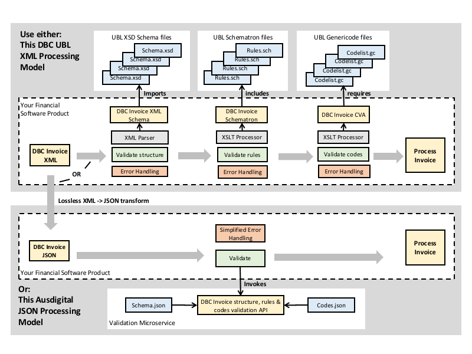

## Introduction

This document describes a JSON based syntax and processing model for UBL semantics. It includes

* A simple JSON syntax model for UBL semantics.
* A lossless transformation model between UBL XML and JSON representations.
* A simple JSON processing model based on a RESTful Validation API 

This Specification

 * can be applied equally to any UBL document (this invoice is just the first) and so is maintained as a separate specification.
 * exists to support the Digital Business Council [e-Invoicing initiative](https://ausdigital.github.io), and is under active development at [https://github.com/ausdigital/ausdigital-syn](https://github.com/ausdigital/ausdigital-syn).

Widespread adoption of the e-invoicing framework depends on the provision of clear, unambiguous and simple specifications that are developer freindly and impose very low implementation costs.  

As shown in the diagram below, the standard UBL XSD/Schemmatron/Genericode processing model imposes significant complexity burdens on implementers.  An alternative REST/JSON microservices model reduces implementation cost and complexity to a near zero minimum.



e-Invoicing implementers can choose whether to consume third party transformation & validation services or whether to build their own microservices based on this specification.


## Goals

The intent is to provide developers with a much simpler implementation model than the XSD/Schematron/Genericode alternative whilst maintianing interoperability with the UBL XML standard.


## Status

This spec is an early draft for consuiltation.

This specification aims to support the Australian Digital Business Council
[eInvoicing initiative](http://ausdigital.org), and is under active
development at
[https://github.com/ausdigital/ausdigital-syn](https://github.com/ausdigital/ausdigital-syn).

Comments and feedback are encouraged and welcome. Pull requests with improvements are welcome too.


## Glossary

Phrase | Definition
------------ | -------------
ausdigital-syn/2 | This specification.
ausdigital-code/1 | Version 1 of the AusDigital [Code Lists Management (CODE)](http://ausdigital.org/ausdigital-code) specification.
ausdigital-bill/1 | Version 1 of the AusDigital [Bill Semantics (BILL)](http://ausdigital.org/bill) specification.
ausdigital-syn/1 | Version 1 of the AusDigital [UBL Syntax(SYN)](http://ausdigital.org/syn) specification.

This service depends on - TBA.

The TBA specification depends on this document. Note, TBA.
 

 ## Licence

Copyright (c) 2016 the Editor and Contributors. All rights reserved.

This Specification is free software; you can redistribute it and/or modify it under the terms of the GNU General Public License as published by the Free Software Foundation; either version 3 of the License, or (at your option) any later version.

This Specification is distributed in the hope that it will be useful, but WITHOUT ANY WARRANTY; without even the implied warranty of MERCHANTABILITY or FITNESS FOR A PARTICULAR PURPOSE. See the GNU General Public License for more details.

You should have received a copy of the GNU General Public License along with this program; if not, see [http://www.gnu.org/licenses](http://www.gnu.org/licenses).


## Change Process

This document is governed by the [2/COSS](http://rfc.unprotocols.org/spec:2/COSS/) (COSS).


## Language

The key words "MUST", "MUST NOT", "REQUIRED", "SHALL", "SHALL NOT", "SHOULD", "SHOULD NOT", "RECOMMENDED", "MAY", and "OPTIONAL" in this document are to be interpreted as described in RFC 2119.

# JSON Syntax for UBL documents

The normative form for UBL documents is XML and the normative definition is the UBL XSD Schema library.  Therefore the JSON syntax implementation for UBL occasionally refers to the XML form when defining the JSON rules.

## JSON Schema Rules

* Each JSON Schema document MUST comply with the [JSON Schema Specification](http://json-schema.org/documentation.html) and contain the JSON element "$schema": "http://json-schema.org/draft-04/schema#".  
* The JSON schema MUST be a standalone single root schema that does not import external fragments but MAY make use of local schema references ($ref) for re-use of common structures.  It is recognised that several different document schema will define the same common structures but this SHOULD be managed at the semantic model level and not at the runtime schema level.
* JSON type definitions MUST use exactly the same name as the corresponding UBL XML element name but without any namespace prefix (ie use the UNQUALIFIED UBL element name).
* JSON schema type definitions MUST include a "description" property and it's value SHOULD equal the corresponding UBL schema <ccts:Definition> property.
* JSON schema type definitions SHOULD NOT use "enum" types for validation of code list values.  This is to allow codes lists to be managed and versioned separately from their use in business document schema.  Please refer to the [code lists](https://github.com/ausdigital/ausdigital-code) specification for the treatment of code lists.

## JSON Instance Rules

* The JSON instance MUST conform to the corresponding JSON schema which is recommended to be attached to the instance by using a Link header in http request according to http://json-schema.org/latest/json-schema-core.html#rfc.section.9.1. For example:
`Link: <https://raw.githubusercontent.com/ausdigital/ausdigital-bill/master/resources/ausdigital-syn/2.0/spec/Invoice.json>; rel="describedby"`
* The JSON instance SHOULD have a "customizationID" element that contains the URI of the relevant implementation context because that will define the relevant code-list values (eg BPay as a payment means in Australia) and business rules (eg that tax invoices over $1000 must contain the buyers ABN) that would be validated.
* If "customizationID" is present then the JSON instance MUST comply with the code-list and business rules defined for that context.  Note that the code-list rules are defined in the [CODE](http://ausdigital.org/ausdigital-code) specification and the business rules are defined together with each semantic specification (eg [BILL 1.0](http://ausdigital.org/specs/ausdigital-bill/1.0/) specification)

## CCTS Property Mapping

All UBL types inherit from the UN/CEFACT Core Component Technical Specification (CCTS) set of 10 core data types. Each CCTS data type has a number of optional properties that are implemented as UBL XML element attributes - for details please refer to the [UBL CCTS Schema Module](https://docs.oasis-open.org/ubl/cs-UBL-2.0/xsd/common/CCTS_CCT_SchemaModule-2.0.xsd).  There are two concerns with mapping CCTS properties to JSON.
* JSON has no equivalent of XML element attributes
* All the CCTS attributes are optional with often overlapping definitions and little implementation guidance for allowed values.  This leads to confusion and interoperability problems. For example, 8 of the 9 attributes of the CCTS "Code" type all serve to identify different attributes of the code list scheme (listID, listAgencyID, listAgencyName, listName, listVersionID, listURI, listSchemeURI).  A single unique identifier of the code list scheme would be sufficient.

In mapping UBL to JSON there is a balance to be struck between a simple mapping algorithm (leading to relatively more complex JSON) and a more complex set of mapping rules (that could deliver simpler JSON).  This specification prioritises simple JSON even at the cost of more complex mapping rules when transforming to/from UBL XML.

### CCTS AmountType

JSON representation SHALL NOT specify currency for every data element.  Instead it SHALL use the UBL document level currency indicator "documentCurrencyCode":"AUD"

Therefore the UBL XML 

```<cbc:LineExtensionAmount currencyID="AUD">500.00</cbc:LineExtensionAmount>``` 

Maps to the UBL JSON

``` "lineExtensionAmount":10.00 ```

### CCTS BinaryObjectType 

UBL supports either embedded or referenced binary attachments.  The JSON implementation SHALL always use the UBL "ExternalReference" Model.  

Therefore the UBL XML

```<cbc:EmbeddedDocumentBinaryObject format="pdf" characterSetCode="utf-8" mimeCode="application/pdf" encodingCode="base64" uri="https://mydomain.com/invoice1234.pdf" filename="invoice1234.pdf">UjBsR09EbGhjZ0dTQUxNQU</cbc:EmbeddedDocumentBinaryObject> ```


Maps to the UBL JSON


```"externalReference":{"uri":"https://mydomain.com/invoice1234.pdf"} ```

Or

```<cac:ExternalReference><cbc:URI>https://mydomain.com/invoice1234.pdf</cbc:URI> <cbc:DocumentHash>H5DGjk67g3SDllk</cbc:DocumentHash><cbc:HashAlgorithmMethod>SHA-1</cbc:HashAlgorithmMethod></cac:ExternalReference> ```

Maps to the UBL JSON

```"externalReference":{"uri":"https://mydomain.com/invoice1234.pdf", "documentHash":"H5DGjk67g3SDllk", "hashAlgorithmMethod":"SHA-1"}```

### CCTS CodeType

The reference codelist scheme for each coded element in a UBL JSON is defined as part of the implementation profile and is referenced through the CustomizationID as described in the [CODE](http://ausdigital.org/ausdigital-code) specification.

Therefore the UBL XML

```<cac:Country> <cbc:IdentificationCode listAgencyID="5" listAgencyName="International Organization for Standardization" listName="Country Identification Code" listVersionID="SecondEdition2006VI-12" name="CountryIdentificationCode" languageID="en" listURI="http://docs.oasis-open.org/ubl/os-UBL-2.1/cl/gc/default/CountryIdentificationCode-2.1.gc" listSchemeURI="urn:un:unece:uncefact:identifierlist:standard:5:ISO316612A">AU</cbc:IdentificationCode> </cac:Country>```

Maps to the UBL JSON

 ```"country":"AU" ``` 
 
### CCTS DateTimeType
 
JSON representation SHALL always use ISO-8601 standard datetime format.
 
Therefore the UBL XML

```<cbc:IssueDate format="iso-8601">2016-07-01</cbc:IssueDate>```
 
Maps to the UBL JSON

```"issueDate":"2016-07-01" ```

### CCTS IdentifierType

The JSON Code Lists specification SHALL maintain normative code-list of unique short names (eg "ABN") for each identifier category (eg party), thereby allowing a XML code type to map to a simple name-value pair in JSON.

Therefore the UBL XML

```<cac:PartyIdentification> <cbc:ID schemeID="urn:oasis:names:tc:ebcore:partyid-type:iso6523:0151" schemeName="ABN" schemeAgencyID="ato.gov.au" schemeAgencyName="Australian Taxation Office" schemeVersionID=" " schemeDataURI="http://abr.business.gov.au/abrxmlsearchRPC/Forms/SearchByABNv201408.aspx" schemeURI="urn:oasis:names:tc:ebcore:partyid-type:iso6523:0151"> 51083392303</cbc:ID> </cac:PartyIdentification>``` 
 
Maps to the UBL JSON

```"partyIdentification":[{"ABN":"51083392303"}] ``` 

### CCTS IndicatorType 

JSON representation SHALL always use the JSON boolean type

Therefore the UBL XML

```<cbc:ChargeIndicator>false</cbc:ChargeIndicator> ```
 
Maps to the UBL JSON
 
```"chargeIndicator":false ```

### MeasureType 

JSON representation SHALL be as a value/unit object tuple and, like UBL XML, will always use UN/ECE Rec20 code list

Therefore the UBL XML

```<cbc:GrossWeightMeasure unitCode="KGM" unitCodeListVersionID="urn:un:unece:uncefact:codelist:specification:66411:8e">130 </cbc:GrossWeightMeasure>``` 
 
Maps to the UBL JSON
 
```"grossWeightMeasure":{"value":130, "unitCode":"KGM"} ```

### CCTS NumericType

JSON representation SHALL always use the JSON Number type 

Therefore the UBL XML

```<cbc:Percent format="decimal">5.0 </cbc:Percent>``` 
 
Maps to the UBL JSON
 
```"percent"51.0 ```

### CCTS QuantityType

JSON representation SHALL be as a value/unit object tuple and, like UBL XML, will always use UN/ECE Rec20 code list

Therefore the UBL XML

```<cbc:InvoicedQuantity unitCode="KG" unitCodeListID="urn:un:unece:uncefact:codelist:specification:66411:8e" unitCodeListAgencyID="UN/ECE" unitCodeListAgencyName="United Nations Economic Commission for Europe">100 </cbc:InvoicedQuantity>``` 
 
Maps to the UBL JSON
 
 ```"invoicedQuantity":{"value":100, "unitCode":"KG"} ```
 
### CCTS TextType
 
JSON representation SHALL NOT specify language for every string data element.  Instead it will use the UBL document level language indicator "Language":"EN" using ISO 639-1 language codes

Therefore the UBL XML

```<cbc:Name languageID="EN" languageLocaleID="AU">ACME Pty Ltd</cbc:Name>``` 
 
Maps to the UBL JSON
 
```"name":"ACME Pty Ltd" ```

# UBL Syntax 2.0 Extended Codes Lists Specification

 * 
 * Editor: Steve Capell
 * Contributors: 

## Introduction

This specification defines a JSON representation for standard code lists (eg the ISO-3166 country code list) and also for context specific subsets and extensions.  
The specification for standard Code Lists (eg the ISO-3166 country code list) is maintained separately - [CODE 1.0](http://ausdigital.org/specs/ausdigital-code/1.0) specification.  

The JSON code list representation and standard API definition provides a alternative to the UBL [Genericode](https://docs.oasis-open.org/codelist/cs-genericode-1.0/doc/oasis-code-list-representation-genericode.html) and [Context/Value Association](http://docs.oasis-open.org/codelist/cs01-ContextValueAssociation-1.0/doc/context-value-association.html) specifications (and the associated XSLT based runtime validation framework) for implementers that prefer a REST/JSON model.

## Context specific lists

**[DBC context specific code lists repository](https://github.com/ausdigital/ausdigital-syn/tree/master/codes/contexts)**

Code lists often need to be restricted or extended for specific business contexts.  For example, in the Australian context, it may be useful to remove most of the European specific payment means codes from the standard UBL code list and to add a code for BPAY.  
  
 * The context specific lists are maintained in the /contexts path and MUST be a copy of a code list in the /core path with only the following changes:
    * Addition of a suffix "contextnn" to the file name - for example PaymentMeansCode-2.1-context01.json
    * "ListURI" element to reflect the new code list URL.
    * A list of ProcessID references as shown in the example above.  These MUST match the "customizationID" field contents in the corresponding business documents that will use the context specific code list.
    * New codes MAY added or existing codes MAY be removed from the object array of codes as needed for the business context - but existing codes MUST NOT be redefined.
  
To create a context specific code list, clone this repository, create the new code list, notify the working group via the slack channel, and issue a pull request.

## Identifier Scheme Lists

**[identifier scheme code lists repository](https://github.com/ausdigital/ausdigital-syn/tree/master/codes/identifiers)** 

This specification introduces an additional type of code list that is a reference list of identifier schemes.  The purpose of these lists is to deliver consistency in the UBL representation of identifier schemes like the ABN as a Party identification.  The code lists also support lossless transformation between simple JSON elements like "ABN":"34132141612" and the full CCTS compliant UBL XML representation by including the CCTS Scheme identification information with each scheme code. 

```
  "CodeList": {
    "ListURI": "https://github.com/ausdigital/ausdigital-code/tree/master/syn/codes/identifiers/PartyIdentifiers-dbc.01.json",
    "SchemeIdentification": {
      "listAgencyName": "Digital Business COuncil",
      "ListID": "PartyID",
      "listSchemeURI": "urn:codes.digitalbusinesscouncil.com.au:partyIdentifiers:ver1.0",
      "ListName": "Party Identifier Schemes",
      "listAgencyID": "Uigitalbusinesscouncil.com.au",
      "listVersionID": "1.0"
    },
    "Codes": [
      {
        "Code": "ABN",
        "Name": "IAustralian Business Number",
        "SchemeIdentification":{
          "schemeID":"urn:oasis:names:tc:ebcore:partyid-type:iso6523:0151",
          "schemeName":"ABN",
          "schemeAgencyID":"ato.gov.au",
          "schemeAgencyName":"Australian Taxation Office",
          "schemeVersionID":"1.0",
          "schemeDataURI":"http://abr.business.gov.au/abrxmlsearchRPC/Forms/SearchByABNv201408.aspx",
          "schemeURI":"urn:oasis:names:tc:ebcore:partyid-type:iso6523:0151"
        },
      },
      {
        "etc":" "
      },
    ]
  }
}
```

## Validation API behaviour

The document validation API behaviour is designed to allow codes used within messages to be validated against a context specific code list where appropriate but to default to the standard code list where a restricted version is not defined for a given process.  The [validation API](https://github.com/ausdigital/ausdigital-syn/blob/master/docs/ValidationAPI.md) SHALL

 * For each code data type in the document, validate the code against the code list identified by the SchemeURI (eg "urn:un:unece:uncefact:codelist:standard:UNECE:PaymentMeansCode:D10B").
 * If the "customizationID" element is present in the document, then use the context specific code list with a matching identifier in the "ProcessID" array.  Otherwise, use the standard code list.
 * There are several error conditions.  The error code and error message are described in the table below and MUST be inserted into the standard error structure defined in the The [validation API](https://github.com/ausdigital/ausdigital-syn/blob/master/docs/ValidationAPI.md) specification.

|Error Code|Error Message|
|----------|-------------|
|Code-01|The value {code value} for data item {data element name} cannot be validated because there is no code list for scheme {schemeURI}.|
|Code-02|The value {code value} for data item {data element name} is not valid in {list name} code list.|
|Code-03|The value {code value} for data item {data element name} is not valid in {list name} restricted code list for context {ProcessID}.|


# Transformation API

The transformation API specification defines a standard interface for lossless, schema-aware transformations 

* UBL2JSON : from standard namespace qualified UBL 2.1 XML to a simple JSON representation. 
* JSON2UBL : from a simple JSON representation to standard namespace qualified UBL 2.1 XML instance.

The JSON instances MUST comply with the [UBL Syntax 2.0 Specification](https://github.com/ausdigital/ausdigital-syn/blob/master/docs/JSONSyntax.md).
The XML instances MUST comply with the [UBL Syntax 1.0 Specification](https://github.com/ausdigital/ausdigital-syn-v1/blob/master/docs/XMLSyntax.md).

## API Specification

Is maintained at swaggerhub : **[UBL Syntax 2.0 Transformation and Validation API](https://app.swaggerhub.com/api/ausdigital/ausdigital-syn/1.0)**

## UBL2JSON Error Response Codes

All error responses will comply with the ausdigital standard [RESTful Errors structure](https://app.swaggerhub.com/domains/ausdigital/ErrorModel/1.0).   

|Error Code | Error Message|
|-----------|--------------|
|ubl2json-01 |The source document is not a valid UBL 2.1 XML instance   |
|ubl2json-02 |Standard code-list scheme not found for {schemeID} at {XML element path}|
|ubl2json-02 |   |

## JSON2UBL Error Response Codes

All error responses will comply with the ausdigital standard [RESTful Errors structure](https://app.swaggerhub.com/domains/ausdigital/ErrorModel/1.0).   

|Error Code | Error Message|
|-----------|--------------|
|json2ubl-01 |The source document is not a valid UBL JSON instance   |
|json2ubl-02 |Standard code-list scheme not found for {JSON path}   |
|json2ubl-02 |   |

## Sample UBL 2.1 XML compliant with UBL Syntax 1.0 Specification

```
<n2:Invoice 
  xmlns:n2="urn:oasis:names:specification:ubl:schema:xsd:Invoice-2" 
  xmlns:cbc="urn:oasis:names:specification:ubl:schema:xsd:CommonBasicComponents-2" 
  xmlns:cac="urn:oasis:names:specification:ubl:schema:xsd:CommonAggregateComponents-2">
  <cbc:UBLVersionID>2.1</cbc:UBLVersionID>
  <cbc:CustomizationID schemeAgencyID="dbc">urn:resources.digitalbusinesscouncil.com.au:dbc:invoicing:documents:core invoice:xsd::core invoice 1##urn:resources.digitalbusinesscouncil.com.au:dbc:einvoicing:process:einvoicing03:ver1.0</cbc:CustomizationID>
  <cbc:ProfileID schemeAgencyID="dbc">urn:resources.digitalbusinesscouncil.com.au:dbc:einvoicing:ver1.0</cbc:ProfileID>
  <cbc:ID>TOSL-108-A</cbc:ID>
  <cbc:IssueDate>2016-07-01</cbc:IssueDate>
  <cbc:DueDate>2016-08-01</cbc:DueDate>
  <cbc:InvoiceTypeCode listAgencyID="6" listAgencyName="International Organization for Standardization" listName="Document Type Code" listVersionID="D10B" name="DocumentTypeCode" languageID="en" listURI="http://docs.oasis-open.org/ubl/os-UBL-2.1/cl/gc/special-purpose/DocumentTypeCode-2.1.gc" listSchemeURI="urn:un:unece:uncefact:codelist:standard:UNECE:DocumentNameCodeAccounting">81</cbc:InvoiceTypeCode>
  <cbc:Note>Credit Note</cbc:Note>
  <cbc:DocumentCurrencyCode listID="ISO 4217 Alpha" listAgencyID="5" listAgencyName="International Organization for Standardization" listName="Currency Code" listVersionID="2012-01-12" name="CurrencyCode" languageID="en" listURI="http://docs.oasis-open.org/ubl/os-UBL-2.1/cl/gc/default/CurrencyCode-2.1.gc" listSchemeURI="urn:un:unece:uncefact:codelist:standard:5:ISO42173A">AUD</cbc:DocumentCurrencyCode>
  <cbc:BuyerReference>CC-3352626</cbc:BuyerReference>
  <cac:InvoicePeriod>
    <cbc:StartDate>2016-05-01</cbc:StartDate>
    <cbc:EndDate>2016-06-01</cbc:EndDate>
  </cac:InvoicePeriod>
  <cac:OrderReference>
    <cbc:ID>SB002</cbc:ID>
  </cac:OrderReference>
  <cac:AccountingSupplierParty>
    <cac:Party>
      <cac:PartyIdentification>
        <cbc:ID schemeID="urn:oasis:names:tc:ebcore:partyid-type:iso6523:088" schemeAgencyID="GS1">4035811611014</cbc:ID>
      </cac:PartyIdentification>
      <cac:PartyName>
        <cbc:Name>ACME Holdings</cbc:Name>
      </cac:PartyName>
      <cac:PostalAddress>
        <cbc:CityName>Adelaide</cbc:CityName>
        <cbc:PostalZone>5000</cbc:PostalZone>
        <cbc:CountrySubentity>South Australia</cbc:CountrySubentity>
        <cac:AddressLine>
          <cbc:Line>88 Grenfell St</cbc:Line>
        </cac:AddressLine>
        <cac:Country>
          <cbc:IdentificationCode listAgencyID="5" listAgencyName="International Organization for Standardization" listName="Country Identification Code" listVersionID="SecondEdition2006VI-12" name="CountryIdentificationCode" languageID="en" listURI="http://docs.oasis-open.org/ubl/os-UBL-2.1/cl/gc/default/CountryIdentificationCode-2.1.gc" listSchemeURI="urn:un:unece:uncefact:identifierlist:standard:5:ISO316612A">AU</cbc:IdentificationCode>
        </cac:Country>
      </cac:PostalAddress>
      <cac:PartyLegalEntity>
        <cbc:CompanyID schemeID="urn:oasis:names:tc:ebcore:partyid-type:iso6523:0151" schemeAgencyID="GS1">987654321</cbc:CompanyID>
      </cac:PartyLegalEntity>
    </cac:Party>
  </cac:AccountingSupplierParty>
  <cac:AccountingCustomerParty>
    <cac:Party>
      <cac:PartyIdentification>
        <cbc:ID schemeID="urn:oasis:names:tc:ebcore:partyid-type:iso6523:0151" schemeAgencyID="GS1">51083392303</cbc:ID>
      </cac:PartyIdentification>
      <cac:PartyName>
        <cbc:Name>Governmment Agency</cbc:Name>
      </cac:PartyName>
      <cac:PostalAddress>
        <cbc:CityName>Willunga</cbc:CityName>
        <cbc:PostalZone>5172</cbc:PostalZone>
        <cbc:CountrySubentity>South Australia</cbc:CountrySubentity>
        <cac:AddressLine>
          <cbc:Line>Delabole Road</cbc:Line>
        </cac:AddressLine>
        <cac:Country>
          <cbc:IdentificationCode listAgencyID="5" listAgencyName="International Organization for Standardization" listName="Country Identification Code" listVersionID="SecondEdition2006VI-12" name="CountryIdentificationCode" languageID="en" listURI="http://docs.oasis-open.org/ubl/os-UBL-2.1/cl/gc/default/CountryIdentificationCode-2.1.gc" listSchemeURI="urn:un:unece:uncefact:identifierlist:standard:5:ISO316612A">AU</cbc:IdentificationCode>
        </cac:Country>
      </cac:PostalAddress>
      <cac:PartyLegalEntity>
        <cbc:CompanyID schemeID="urn:oasis:names:tc:ebcore:partyid-type:iso6523:0151" schemeAgencyID="GS1">51083392303</cbc:CompanyID>
      </cac:PartyLegalEntity>
    </cac:Party>
    <cac:BuyerContact>
      <cbc:ID>Tony Curtis</cbc:ID>
      <cbc:Telephone>(08) 8556 2345</cbc:Telephone>
      <cbc:ElectronicMail>curtis@willunga.gov.au</cbc:ElectronicMail>
    </cac:BuyerContact>
  </cac:AccountingCustomerParty>
  <cac:Delivery>
    <cbc:ActualDeliveryDate>2016-03-02</cbc:ActualDeliveryDate>
    <cac:DeliveryAddress>
      <cbc:CityName>Adelaide</cbc:CityName>
      <cbc:PostalZone>5000</cbc:PostalZone>
      <cbc:CountrySubentity>South Australia</cbc:CountrySubentity>
      <cac:AddressLine>
        <cbc:Line>202 North Terrace</cbc:Line>
      </cac:AddressLine>
      <cac:Country>
        <cbc:IdentificationCode listAgencyID="5" listAgencyName="International Organization for Standardization" listName="Country Identification Code" listVersionID="SecondEdition2006VI-12" name="CountryIdentificationCode" languageID="en" listURI="http://docs.oasis-open.org/ubl/os-UBL-2.1/cl/gc/default/CountryIdentificationCode-2.1.gc" listSchemeURI="urn:un:unece:uncefact:identifierlist:standard:5:ISO316612A">AU</cbc:IdentificationCode>
      </cac:Country>
    </cac:DeliveryAddress>
  </cac:Delivery>
  <cac:PaymentMeans>
    <cbc:ID>EFT</cbc:ID>
    <cbc:PaymentMeansCode listID="UN/ECE 4461" listAgencyID="6" listAgencyName="United Nations Economic Commission for Europe" listName="Payment Means Code" listVersionID="D10B" name="PaymentMeansCode" languageID="en" listURI="http://docs.oasis-open.org/ubl/os-UBL-2.1/cl/gc/default/PaymentMeansCode-2.1.gc" listSchemeURI="urn:un:unece:uncefact:codelist:standard:UNECE:PaymentMeansCode">2</cbc:PaymentMeansCode>
    <cbc:InstructionID>888276612262653</cbc:InstructionID>
    <cac:PayeeFinancialAccount>
      <cbc:ID>2000987211</cbc:ID>
      <cac:FinancialInstitutionBranch>
        <cbc:ID schemeName="BSB">086016</cbc:ID>
        <cbc:Name>NAB Adelaide</cbc:Name>
      </cac:FinancialInstitutionBranch>
    </cac:PayeeFinancialAccount>
  </cac:PaymentMeans>
  <cac:TaxTotal>
    <cbc:TaxAmount>250.00</cbc:TaxAmount>
  </cac:TaxTotal>
  <cac:LegalMonetaryTotal>
    <cbc:LineExtensionAmount>2500.00</cbc:LineExtensionAmount>
    <cbc:TaxExclusiveAmount>2500.00</cbc:TaxExclusiveAmount>
    <cbc:TaxInclusiveAmount>2750.00</cbc:TaxInclusiveAmount>
    <cbc:PayableAmount>2750.00</cbc:PayableAmount>
  </cac:LegalMonetaryTotal>
  <cac:InvoiceLine>
    <cbc:ID>1</cbc:ID>
    <cbc:Note>A variety of Widgets</cbc:Note>
    <cbc:InvoicedQuantity>200</cbc:InvoicedQuantity>
    <cbc:LineExtensionAmount>2000.00</cbc:LineExtensionAmount>
    <cac:TaxTotal>
      <cbc:TaxAmount>200.00</cbc:TaxAmount>
      <cac:TaxSubtotal>
        <cbc:TaxAmount>10.00</cbc:TaxAmount>
        <cac:TaxCategory>
          <cac:TaxScheme>
            <cbc:ID>GST</cbc:ID>
          </cac:TaxScheme>
        </cac:TaxCategory>
      </cac:TaxSubtotal>
    </cac:TaxTotal>
    <cac:Item>
      <cbc:Description>Widget</cbc:Description>
      <cac:SellersItemIdentification>
        <cbc:ID>WDGT-A1733-0436</cbc:ID>
      </cac:SellersItemIdentification>
      <cac:StandardItemIdentification>
        <cbc:ID schemeID="GTIN" schemeAgencyID="GS1">9501101021037</cbc:ID>
      </cac:StandardItemIdentification>
    </cac:Item>
    <cac:Price>
      <cbc:PriceAmount>10.00</cbc:PriceAmount>
      <cbc:BaseQuantity>1</cbc:BaseQuantity>
    </cac:Price>
  </cac:InvoiceLine>
  <cac:InvoiceLine>
    <cbc:ID>2</cbc:ID>
    <cbc:Note>Widget attachments</cbc:Note>
    <cbc:InvoicedQuantity>200</cbc:InvoicedQuantity>
    <cbc:LineExtensionAmount>500.00</cbc:LineExtensionAmount>
    <cac:TaxTotal>
      <cbc:TaxAmount>50.00</cbc:TaxAmount>
      <cac:TaxSubtotal>
        <cbc:TaxAmount>10.00</cbc:TaxAmount>
        <cac:TaxCategory>
          <cac:TaxScheme>
            <cbc:ID>GST</cbc:ID>
          </cac:TaxScheme>
        </cac:TaxCategory>
      </cac:TaxSubtotal>
    </cac:TaxTotal>
    <cac:Item>
      <cbc:Description>Widget screws</cbc:Description>
      <cac:SellersItemIdentification>
        <cbc:ID>WDGT-A1733-0437</cbc:ID>
      </cac:SellersItemIdentification>
      <cac:StandardItemIdentification>
        <cbc:ID schemeID="GTIN" schemeAgencyID="GS1">9501101021038</cbc:ID>
      </cac:StandardItemIdentification>
    </cac:Item>
    <cac:Price>
      <cbc:PriceAmount>2.50</cbc:PriceAmount>
      <cbc:BaseQuantity>1</cbc:BaseQuantity>
    </cac:Price>
  </cac:InvoiceLine>
</n2:Invoice>
```

## Sample UBL JSON file compliant with UBL Syntax 2.0 Specification

```
{
  "Invoice": {
    "ublVersionID": "2.1",
    "customizationID": {
      "schemeAgencyID": "dbc",
      "value": "urn:resources.digitalbusinesscouncil.com.au:dbc:invoicing:documents:core invoice:xsd::core invoice 1##urn:resources.digitalbusinesscouncil.com.au:dbc:einvoicing:process:einvoicing03:ver1.0"
    },
    "profileID": {
      "schemeAgencyID": "dbc",
      "value": "urn:resources.digitalbusinesscouncil.com.au:dbc:einvoicing:ver1.0"},
    "id": "TOSL-108-A",
    "issueDate": "2016-07-01",
    "dueDate": "2016-08-01",
    "invoiceTypeCode": "81",
    "note": [
      "Credit Note"],
    "documentCurrencyCode": "AUD",
    "buyerReference": "CC-3352626",
    "invoicePeriod": [{
        "startDate": "2016-05-01",
        "endDate": "2016-06-01"}
    ],
    "orderReference": "SB002",
    "accountingSupplierParty": {
      "party": {
        "partyIdentification": [{
            "GLN": "4035811611014"}],
        "partyName": [{
            "name": "ACME Holdings"}],
        "postalAddress": {
          "cityName": "Adelaide",
          "postalZone": "5000",
          "countrySubentity": "South Australia",
          "addressLine": [{
              "line": "88 Grenfell St"}],
          "country": "AU"},
        "partyLegalEntity": [{
            "companyID": {
              "ABN": "987654321"}
          }]
      }
    },
    "accountingCustomerParty": {
      "party": {
        "partyIdentification": [{
            "ABN": "51083392303"}],
        "partyName": [{
            "name": "Governmment Agency"}],
        "postalAddress": {
          "cityName": "Willunga",
          "postalZone": "5172",
          "countrySubentity": "South Australia",
          "addressLine": [{
              "line": "Delabole Road"}],
          "country": "AU"},
        "partyLegalEntity": [{
            "companyID": {
              "ABN": "51083392303"}
           }]
      },
      "buyerContact": {
        "id": "Tony Curtis",
        "telephone": "(08) 8556 2345",
        "electronicMail": "curtis@willunga.gov.au"}
    },
    "delivery": [{
        "actualDeliveryDate": "2016-03-02",
        "deliveryAddress": {
          "cityName": "Adelaide",
          "postalZone": "5000",
          "countrySubentity": "South Australia",
          "addressLine": [{
              "line": "202 North Terrace"}],
          "country": "AU"}
      }
    ],
    "paymentMeans": [
      {
        "id": "EFT",
        "paymentMeansCode": "2",
        "instructionID": "888276612262653",
        "payeeFinancialAccount": {
          "id": "2000987211",
          "financialInstitutionBranch": {
            "id": {
              "schemeName": "BSB",
              "value": "086016"},
            "name": "NAB Adelaide"}
        }
      }],
    "taxTotal": [{
        "taxAmount": "250.00"}],
    "legalMonetaryTotal": {
      "lineExtensionAmount": "2500.00",
      "taxExclusiveAmount": "2500.00",
      "taxInclusiveAmount": "2750.00",
      "payableAmount": "2750.00"},
    "invoiceLine": [{
        "id": "1",
        "note": [
          "A variety of Widgets"],
        "invoicedQuantity": 200,
        "lineExtensionAmount": "2000.00",
        "taxTotal": [{
            "taxAmount": "200.00",
            "taxSubtotal": [{
                "taxAmount": "10.00",
                "taxCategory": {
                  "taxScheme": "GST"}}]
          }],
        "item": {
          "description": [
            "Widget"],
          "sellersItemIdentification": "WDGT-A1733-0436",
          "standardItemIdentification": {
            "GTIN": "9501101021037"}},
        "price": {
          "priceAmount": "10.00",
          "baseQuantity": 1}},
      {
        "id": "2",
        "note": [
          "Widget attachments"],
        "invoicedQuantity": 200,
        "lineExtensionAmount": "500.00",
        "taxTotal": [{
            "taxAmount": "50.00",
            "taxSubtotal": [{
                "taxAmount": "10.00",
                "taxCategory": {
                  "taxScheme": "GST"}
              }]
          }],
        "item": {
          "description": [
            "Widget screws"],
          "sellersItemIdentification": "WDGT-A1733-0437",
          "standardItemIdentification": {
            "GTIN": "9501101021038"}
        },
        "price": {
          "priceAmount": "2.50",
          "baseQuantity": 1
        }
      }]
  }
}
```


# Validation API Specifications

The validation API specification defines a standard interface for the validation of UBL JSON instances at three levels

* Structure : that the JSON instance conforms to the corresponding JSON schema for the specific document type as referenced by the "$schema" element in the JSON instance.
* Codes : that the code values used in the JSON instance are defined in a relevant code-list, which may be either a core code-list or a context specific code list.
* Rules : that the JSON instance complies with the specific business rules for the implementation context identified by the "ProfileID" element in the JSON instance.

The JSON instances MUST comply with the [UBL Syntax 2.0 Specification](https://github.com/ausdigital/ausdigital-syn/blob/master/docs/JSONSyntax.md).

## Validation Context

As defined by the [UBL Customisation Guide](http://docs.oasis-open.org/ubl/guidelines/UBL2-Customization1.0cs01.pdf) and as implemented by the DBC, UBL allows for the notions of "CustomizationID" and "ProfileID" that are used to define additional restrictions or rules that apply in a specific geographic or industry or process context.   In general, the "CustomizationID" represents a broad context whilst "ProfileID" reflects further restrictions within that broad context.   The Ausdigital.org suite of semantic specifications uses these two identifiers as follows:

* There is one "CustomizationID" value that indicates the Australian Digital Business Council restrictions on the global UBL documents. The set of DBC restrictions is evident when comparing the DBC [CoreInvoice Schema](https://github.com/ausdigital/ausdigital-bill/blob/master/resources/ausdigital-syn/1.0/specrt/maindoc/CoreInvoice-1.0.xsd) with the equivalent global UBL 2.1 [Invoice Schema](http://docs.oasis-open.org/ubl/os-UBL-2.1/xsdrt/maindoc/UBL-Invoice-2.1.xsd).  
* There are a number of "ProfileID" values that represent the rules that apply when the core invoice is used in specific business processes such as RCTI, TaXReceipt, CreditNote, etc.  The rules are defined with each semantic specification (eg [billing semantics](https://github.com/ausdigital/ausdigital-bill)

All validation rules are tagged with the relevant customizationID(s) and profileID(s) that apply.  Each instance document also contains both these identifiers.   Therefore the validation model is to examine the instance document to determine which validation rules should be applied.

## API Validator Specification

Is maintained at swaggerhub : **[UBL Syntax 2.0 Transformation and Validation API](https://app.swaggerhub.com/api/ausdigital/ausdigital-syn/1.0)**

The API is very simple - it accepts an instance document and returns a list of zero or more error responses. All error responses will comply with the ausdigital standard [RESTful Errors structure](https://app.swaggerhub.com/domains/ausdigital/ErrorModel/1.0).  

## Document Structure Error Response Codes


|Error Code | Error Message|
|-----------|--------------|
|struct-01 | The $schema reference is missing and so this document cannot be validated  |
|struct-02 |   |
|struct-03 |   |

## Code-List Error Response Codes

Are maintained together with the [CODE 1.0](http://ausdigital.org/specs/ausdigital-code/1.0) specification  

## Business Rules Error Response Codes

Are maintained together with the relevant semantic specification - for example [BILL 1.0](http://ausdigital.org/specs/ausdigital-bill/1.0/) specification

# Related Material

 * AusDigital eInvoicing Implementation Guide (v1.0, available [here](https://github.com/ausdigital/ausdigital-syn/blob/master/docs/1.0/eInvoicing_Implementation_Guide_v1.0.pdf)), which provides background to the [AusDigital](http://ausdigital.org) community process.
 * [GitHub issues](https://github.com/ausdigital/ausdigital-syn/issues/) for collaborating on the development of the SYN.
 * A reference [SYN service](https://syn.testpoint.io/) (for testing and development purposes).
 * Free, Open-Source Software [SYN implementation](https://github.com/test-point/testpoint-syn).
 * An automated [SYN test suite](https://github.com/test-point/testpoint-syn).
