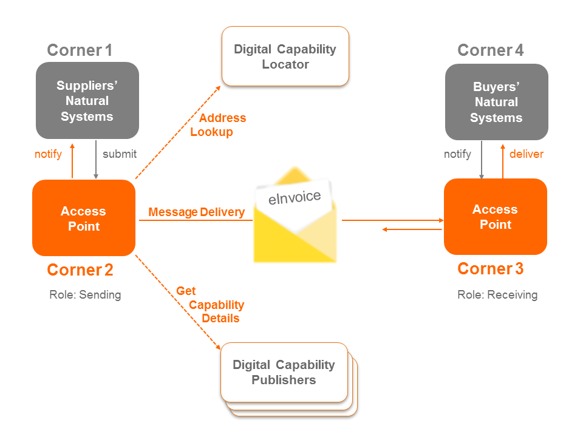

## Introduction

This document describes a protocol for exchanging formal documents (such as invoices) between businesses. TAP is a secure, decentralised, peer to peer architecture where gateways are optional and minimally trusted.

## Goals

The primary goal of the Transaction Access Point (TAP) 1.0 Specification is to TBA.

The Transaction Access Point (TAP) 1.0 Specification defines TBA.

## Status

This spec is an early draft for consuiltation.

This specification aims to support the Australian Digital Business Council
[eInvoicing initiative](http://ausdigital.org), and is under active
development at
[https://github.com/ausdigital/ausdigital-tap](https://github.com/ausdigital/ausdigital-tap).

Comments and feedback are encouraged and welcome. Pull requests with improvements are welcome too.

## Glossary

Phrase | Definition
------------ | -------------
ausdigital-tap/1 | This specification.
ausdigital-dcl/1 | Version 1 of the AusDigtial [Digital Capability Locator (DCL)](http://ausdigital.org/specs/ausdigital-dcl/1.0) specification
ausdigital-idp/1 | Version 1 of the AusDigital [Identity Provider (IDP)](http://ausdigital.org/specs/ausdigital-idp/1.0) specification.
ausdigital-dcp/1 | Version 1 of the AusDigital [Digital Capability Publisher (DCP)](http://ausdigital.org/ausdigital-tap) specification.
ausdigital-tap/2 | Version 2 of the AusDigital [Transaction Access Point(TAP)](http://ausdigital.org/ausdigital-tap) specification.
ausdigital-nry/1 | Version 1 of the AusDigital [Notary (NRY)](http://ausdigital.org/ausdigital-nry) specification.

The TAP service depends on TBA and TBA.

Other TBA and TBA services both depend on the TAP service.

## Licence

Copyright (c) 2016 the Editor and Contributors. All rights reserved.

This work is licensed under a Creative Commons Attribution 4.0 International License.

## Change Process

This document is governed by the [2/COSS](http://rfc.unprotocols.org/spec:2/COSS/) (COSS).

## Language

The key words "MUST", "MUST NOT", "REQUIRED", "SHALL", "SHALL NOT", "SHOULD", "SHOULD NOT",
"RECOMMENDED", "MAY", and "OPTIONAL" in this document are to be interpreted as described in
RFC 2119.

## Overview

The Access Point Implementation Guide defines the standards for delivering and receiving of digital business documents within the Council’s Interoperability Framework (Framework). The Framework defines the following components:
* Access Point: A sender or receiver of digital business documents;
* Digital Capability Locator: A service for looking up the location of the Digital Capability Publisher for a Participant. (Digital Business Council, 2016a);
* Digital Capability Publisher: A service for Participants to store details of their capabilities, and includes what scenarios they can process, the data formats they support and the delivery address for their eInvoices. (Digital Business Council, 2016b); and
* Electronic Business Documents: A digital representation of a business document, e.g. an eInvoice.

Figure 1: Context of Access Points within the Interoperability Framework

The messaging protocol described in this document is business process and business document agnostic. The underlying OASIS ebMS3 standard has been designed to be flexible and support a large number of use cases. This implementation guide reduces complexity by focusing on the exchange of business documents regardless of their type or the process in which they are used.

The context diagram Figure 1 shows the components included in the Interoperability Framework and where the Access Point (AP) sits. The Digital Capability Publisher and Digital Capability Locator are used by the Access Points and enable the eInvoicing process.

The components of the framework are used in a four-corner model (see Figure 2: Four Corner Model). End users, or participants, don’t directly exchange electronic information but connect through a network of Access Points. The digital address for a receiving Access Point is dynamically discovered using the Digital Capability Locator (DCL) and Digital Capability Publisher(DCP) components of the Framework. Access Points may also update a participant’s digital endpoint in the DCP.

Figure 2: Four Corner Model

See the complete [Access Point Implementation Guide](./Access_Point_Implementation_Guide_v1.0.pdf) for further details.

# Related Material

 * AusDigital Transaction Access Point Implementation Guide (v1.0, available [here](https://github.com/ausdigital/ausdigital-tap/blob/master/docs/1.0/Digital_Capability_Publisher_Implementation_Guide_v1.0.pdf)), which provides background to the [AusDigital](http://ausdigital.org) community process.
 * [GitHub issues](https://github.com/ausdigital/ausdigital-tap/issues/) for collaborating on the development of the TAP.
 * A reference [TAP service](https://testpoint.io/tap) (for testing and development purposes).
 * Free, Open-Source Software [TAP implementation](https://github.com/test-point/testpoint-tap).
 * An automated [TAP test suite](https://github.com/test-point/testpoint-tap).
