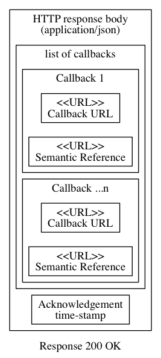

## Introduction

This document describes a protocol for exchanging formal documents (such as invoices)
between businesses. TAP is a secure, decentralised, peer to peer architecture where gateways
are optional and minimally trusted.

## Goals

The primary goal of the Transaction Access Point (TAP) 2.0 Specification is to TBA.

The Transaction Access Point (TAP) 2.0 Specification defines TBA.


## Status

This spec is an early draft for consuiltation.

This specification aims to support the Australian Digital Business Council
[eInvoicing initiative](http://ausdigital.org), and is under active
development at
[https://github.com/ausdigital/ausdigital-tap](https://github.com/ausdigital/ausdigital-tap).

Comments and feedback are encouraged and welcome. Pull requests with improvements are welcome too.


## Glossary:

phrase | Definition
------------ | -------------
ausdigital-tap/2 | Version 2 of the [AusDigtial](http://ausdigital.org) [TAP](http://ausdigital.org/specs/ausdigital-tap/2.0/) specification
ausdigital-tapgw/1 | Version 1 of the [AusDigtial](http://ausdigital.org) [TAP-GW](http://ausdigital.org/specs/ausdigital-tap-gw/1.0/) specification
ausdigital-bill/1 | Version 1 of the [AusDigtial](http://ausdigital.org) [BILL](http://ausdigital.org/specs/ausdigital-bill/1.0/) specification
ausdigital-dcl/1 | Version 1 of the [AusDigtial](http://ausdigital.org) [DCL](http://ausdigital.org/specs/ausdigital-dcl/1.0) specification
ausdigital-dcp/1 | Version 1 of the [AusDigtial](http://ausdigital.org) [DCP](http://ausdigital.org/specs/ausdigital-dcp/1.0) specification
ausdigital-nry/1 | Version 1 of the [AusDigtial](http://ausdigital.org) [NRY](http://ausdigital.org/specs/ausdigital-nry/1.0/) specification
ausdigital-idp/1 | Version 1 of the [AusDigtial](http://ausdigital.org) [IDP](http://ausdigital.org/specs/ausdigital-idp/1.0/) specification


## Licence

Copyright (c) 2016 the Editor and Contributors. All rights reserved.

This Specification is free software; you can redistribute it and/or modify it under the
terms of the GNU General Public License as published by the Free Software Foundation; 
either version 3 of the License, or (at your option) any later version.

This Specification is distributed in the hope that it will be useful, but WITHOUT ANY
WARRANTY; without even the implied warranty of MERCHANTABILITY or FITNESS FOR A PARTICULAR
PURPOSE. See the GNU General Public License for more details.

You should have received a copy of the GNU General Public License along with this program;
if not, see [http://www.gnu.org/licenses](http://www.gnu.org/licenses).


## Change Process

This document is governed by the [2/COSS](http://rfc.unprotocols.org/spec:2/COSS/) (COSS).


## Language

The key words "MUST", "MUST NOT", "REQUIRED", "SHALL", "SHALL NOT", "SHOULD", "SHOULD NOT",
"RECOMMENDED", "MAY", and "OPTIONAL" in this document are to be interpreted as described in
RFC 2119.


# Introduction

The Transaction Access Point (TAP) is a persistently connected "peer" capable of sending and
receiving business documents, such as invoices. It interacts with other TAPs following the
protocol specified in this document. The TAP is an autonomous agent in business-to-business
document exchange.

A TAP might be provided by a commercial ledger service, or maintained as part of an
independent business system. 

The TAP specification has two parts. The main part (ausdigital-tap/2) defines the protocol all peers
must follow (and interfaces they must provide) to send and receive business documents. The
second part is an optional gateway specification (ausdigital-tapgw/1), which defines a client-server
protocol for trusted business system components (e.g. ledger services) to interact with independent TAP service providers in a generic way.


## Dependencies

The messages sent between TAPs carry semantic payloads. Currently, these include
ausdigital-bill/1.
That specification is maintained independently in the
[https://github.com/ausdigital/ausdigital-bill](https://github.com/ausdigital/ausdigital-bill)
repository. Future semantic payloads may be supported without change to the protocol.

All TAPs depend on the following Services:

 * ausdigital-dcl/1 
 * ausdigital-dcp/1 
 * ausdigital-nry/1 

TAPGW providers also depend on the
ausdigital-idp/1. TAPs do not need to
authenticate when they interact with each other, due to use of well known cryprograpic keys
and service endpoint addresses.


## TAP Protocol Overview

In this protocol, a Transaction Access Point (TAP) is a business system component that sends and receives business messages. The TAP Protocol describes how one TAP sends the message, and how the other TAP responds when a message is received.

The message is sent to the receiving TAP using HTTP POST operation, with a `Content-Type: multipart/form-data` body. This body contains two parts, `message` and `signature`.

The `message` part is a mixture of cleartext metadata (used by TAPs) and enciphered payload (used by trusted business system components). The cleartext metadata does not contain sensitive business information, whereas access to the business-sensitive information within the payload is not necessary for participating in the TAP protocol.

The `signature` part is created by a business system component trusted by the sender (with access to the sender's private key material). The signature can be used as a unique identifier of the message contents (e.g. transmitted document id).


Receiving TAPs may also use the signature as a filter (messages with invalid signatures MAY be dropped by receiving TAPs, rather than delivered). This allows TAPs to buffer trusted components from anonymous denial of service attacks.

When a valid message is received, the TAP issues an HTTP 200 status and returns a response body with `Content-Type: text/json`, containing a HATEOS-style list of callback URLs.



See the TAP Protocol Details chapter for more information.


# TAP Protocol Details

The TAP Protocol is a very simple REST API. One business sends a message directly to another business' TAP endpoint (discovered via the SMP):

 * The sender uses the HTTP POST verb (over HTTPS) to send the signed message to a TAP.
 * The TAP replies with a HATEOS-style list of callback URLs.
 * The TAP notarises some non-sensitive but useful data to the blockchain.


## Sending a business message

Pre-requisites:

 * Sender knows their own business identity, and has access to their own private key.
 * Sender knows the recipient business identity (e.g. ABN).
 * Sender knows recipient Digital Capability Publisher (DCP) address, which can be discovered from business identity using ausdigital-dcl/1.
 * Sender knows appropriate TAP endpoint address for the intended message type (discovered via DCP lookup).
 * Sender knows appropriate recipient public key (discovered via DCP lookup).
 * The sender has a valid cleartext (not encrypted) business document to send (e.g. an invoice), encoding the appropriate business semantics (e.g. UBL2.0) in an appropriate format (e.g. json).

The process is:

 * Sign the business message
 * Create hash of signed business document
 * Create cyphertext of the signed business document
 * Create message
 * Generate message signature
 * POST message and signature to the recipient TAP


### Sign the Business Document

The TAP protocol MAY be used to transport any business message in any format. It MAY be used to transport messages compliant with Billing Semantics. Messages SHOULD be formatted as XML or JSON and UTF-8 encoded.

Message signing is interpreted in the sense used by the OpenPGP standard (RFC4880), however strict compliance would involve 3DES algorithm which is not supported. Approved signing algorithms are those determined `--safe` by the *modern* (Eliptic Curve Cryptography compatible) distribution of GnuPG. This is version 2.1.15 at the time of writing, but any stable release at or above v2.1.15 is appropriate.

The following public key formats are supported:

 * ECC (RFC6637)
 * RSA (RFC4880)

Business documents compression is discouraged, because it is redundant due to compression at the HTTP layer (per RFC2616 and RFC1952). Business documents MAY be compressed with ZIP (RFC1951), ZLIB (RFC1950), or BZip2 algorithms.

The business document and signature are combined into a single ASCII-Armoured file per RFC4880 (i.e. including use of Radix-64 to convert UTF-8 to 7 bit ASCII in the signed file). For example, assuming the current working directory contains a business document `doc.json`, a signed document `signed_doc.txt` can be created using the GnuPG command line program like this:

```bash
gpg2 \
 --output "signed_doc.txt" \
 --clearsign "doc.json"
```


### Create hash of signed business document

The following hash algorithms are approved for use:

 * SHA256
 * SHA384
 * SHA512
 * BLAKE2b
 * BLAKE2s

It is not necessary to sign the hash, because the entire message is signed.

This hash is of the cleartext "signed business document". When the recipient decrypts the business document, they are able to verify the hash. If the recipient-generated hash does not match the hash in the message, the recipient MUST NOT provide business acceptance of the document.

If a 3rd party is presented with a copy of the message (including this hash), and with a copy of the signed business document, they are able to verify that the hash of the signed business document matches the hash in the message. That way, if the recipient provides business acceptance of the document, the third party knows the document that was accepted matches the cleartext document they were shown (despite the fact the 3rd party does not have access to recipient key material).

Assuming the current working directory contains a signed document `signed_doc.txt`, a hash of the signed document `signed_doc.hash` can be created with openssl like this:

```bash
openssl dgst -sha256 -out "signed_doc.hash"  "signed_doc.txt"
```


### Create cyphertext of signed business document

The message does not contain plaintext of the business message (signed or otherwise). It contains the hash of the signed plaintext (as per above), and cyphertext of the plaintext message.

The cyphertext is created using public key cryptography, using the appropriate public key for the recipient business endpoint, and the appropriate private key of the sender. The public parts of these keypairs are discoverable using the appropriate DCP for each business identifier URNs, which is discoverable using the global DCL. Public keys MUST be published in ASCII-Armoured form in the DCP.

Use of mature and extensively scrutinised cryptography implementations is strongly encouraged. The following examples use GnuPG, although any compliant RFC4880 implementation could be used in an equivalent way.

Assuming the recipient's public key is not already in the sender's GnuPG keyring, but is in the current working directory as `recipient.gpg`, it can be added to the sender's GnuPG keyring like this:

```bash
gpg2 --import "recipient.gpg"
```

With GnuPG, this is only necessary once. Subsequent messages to the same recipient can skip the key importing step.


#### Note about published keys

(this should actually be in the DCP spec)

Under RFC4880, exported public keys (such as `recipient.gpg` file above) MAY contain notation data pertaining to the owner of the keypair (TAP endpoint). This notation data contains a registered IETF namespace and a user namespace. The user namespace resembles an email address with a string, then the "@" character, and then a DNS name. When keys are used to represent individuals, this identifying information is usually name and email address.

Public Keys issues in the DCP MUST have a user namespace identifier that is unique to the published endpoint. The dns part of the user namespace is the DNS address of the DCP (and also the NAPTR record of the business discoverable via DCL). The string on the left of the "@" character should be a SHA256 hash of the endpoint URL, exactly as it is published in the DCP.

This user namespace identifier of the public key is used to access the key from a keyring.

(end of note about public keys)

Once the recipient's key has been added to the sender's keyring, and assuming the current working directory contains a signed document `signed_doc.txt`, and the user namespace identifier of the recipient public key is `91f68ffafa1288ad55cb3e61e937870fb5598cc098e125fe29412ab3047f15e1@smp.testpoint.io` then cyphertext of signed business document can be created with:

```
gpg2 --armour \
 --output "cyphertext.gpg"
 --encrypt \
 --recipient 91f68ffafa1288ad55cb3e61e937870fb5598cc098e125fe29412ab3047f15e1@smp.testpoint.io \
 signed_doc.txt
```

This will create a file `cyphertext.gpg` in the current working directory, which has ASCII-Armour encoding (suitable for inclusion in a json document).


### Compose Message

The `message` part is a mixture of cleartext metadata (used by TAPs) and enciphered payload (used by trusted business system components). The cleartext metadata does not contain sensitive business information, whereas access to the business-sensitive information within the payload is not necessary for participating in the TAP protocol.

The message part does not need to be in any kind of canonical form. It MUST be a valid json document.

Assuming the current working directory contains:

 * `cyphertext.gpg`, containing encrypted signed business document in ASCII-Armour format
 * `signed_doc.hash`, containing digest of the signed business document
 * `reference.txt`, containing arbitrary string related to the document
 * `sender.txt`, containing the URN of the business identifier of the sender

Then the following python script will create `message.json` file containing the cyphertext and associated metadata in json format.

```python
import json

def read_cyphertext(filename="cyphertext.gpg"):
    return open(filename, 'r').read().strip()

def read_hash(filename="signed_doc.hash"):
    return open(filename, 'r').read().strip()

def read_reference(filename="reference.txt"):
    return open(filename, 'r').read().strip()

def read_sender(filename="sender.txt"):
    return open(filename, 'r').read().strip()

def compose_message(filename="message.json", indent=4):
    message = {
        'cyphertext': read_cyphertext(),
        'hash': read_hash(),
        'reference': read_reference(),
        'sender': read_sender(),
    }
    result_file = open(filename, 'w')
    result_file.truncate()
    result_file.write(
        json.dumps(message, indent=indent)
    )
    result_file.write('\n')

if __name__ == "__main__":
    compose_message()
```


### Generate signature

The `signature` part is created by a business system component trusted by the sender (with access to the sender's private key material). The signature can also be used to uniquely identify the message contents.


Assuming the current working directory contains the message (as `message.json`), the following command will create a signature `message.sig`:

```bash
gpg2 --output message.sig --sign message.json
```


### Posting the message to the recipient TAP

Layered on top of HTTP Protocol:

 * MUST use HTTPS (RFC2818).
 * MUST use `Content-Type: multipart/form-data` (RFC2388)
 * MUST NOT use `Content-Type: application/x-www-form-urlencode` (RFC1876 is NOT supported)
 * MAY explicitly declare `Content-Transfer-Encoding: base64`
 * MUST NOT rely on additional TAP-related information in HTTP headers, such as message or conversation identifiers.

The message is sent to the receiving TAP using HTTP POST operation. The posted body contains two parts, named `message` and `signature`.

Assuming the current working directory contains the message (as message.json) and signature (as message.sig), the following curl command will post the message to the recipient TAP (replace `<TAP_URL>` with HTTPS URL discovered from the Service Metadata Publisher).

```bash
curl -X POST \
 -H "Content-Type: multipart/form-data" \
 -F "message=@message.json" \
 -F "signature=@message.sig" \
 <TAP_URL>
```

## Receipt and Technical Acknowledgement

When a valid message is received, the TAP issues an HTTP 200 status and returns a response body with `Content-Type: text/json`, containing a HATEOS-style list of callback URLs.

TODO:

 * example response.
 * explain callback URLs
 * explain callback semantic URLs
 * define error responses.

 
# Security

This chapter is TODO.


Deployment Model and Operator Experience


Protocol Elements

 * HTTPS Requests
 * ...
 * Errors
 * Replay protection ?


Identity Management

 * Resources
 * Directory


Security Considerations

 * Threat model
 * LAPGW: Integrity of Authorizations
 * LAPGW: Preventing Authorization Hijacking
 * Denial-of-Service Considerations
 * ...other policy/controls


References

 * Normative References
 * Informative References
 

# Related Material

 * AusDigital Transaction Access Point Implementation Guide (v1.0, available [here](https://github.com/ausdigital/ausdigital-tap/blob/master/docs/1.0/Digital_Capability_Publisher_Implementation_Guide_v1.0.pdf)), which provides background to the [AusDigital](http://ausdigital.org) community process.
 * [GitHub issues](https://github.com/ausdigital/ausdigital-tap/issues/) for collaborating on the development of the TAP.
 * A reference [TAP service](http://testpoint.io/tap) (for testing and development purposes).
 * Free, Open-Source Software [TAP implementation](https://github.com/test-point/testpoint-tap).
 * An automated [TAP test suite](https://github.com/test-point/testpoint-tap).
